# Consistent Photorealistic Characters in SDXL: Building the Anchor Image

**Scope:** This guide covers SDXL in ComfyUI, built node-by-node (no pre-built workflow downloads), as the *production* family — the deepest ecosystem for ControlNet, adapters, and LoRA tooling, and the right platform for learning the technique. Newer instruction-editing families (Qwen-Image-Edit, FLUX Kontext) use a different identity mechanism and are out of scope for the pipeline itself, with one deliberate exception: Step 7 documents using them as a *dataset factory* for LoRA training, where their native identity preservation outperforms the adapter machinery this guide teaches. The rule that reconciles the two: LoRAs are family-locked, datasets are not.

**Goal:** Convert a written character description into a single high-quality, full-body **anchor image** (plus a small kit of derived reference crops) that downstream image-to-image workflows can use to reproduce the character consistently.

---

## 1. Core Principle: What Actually Creates Consistency

Understand this before building anything, because it dictates the whole architecture:

| Component | What it controls | What it does NOT control |
|---|---|---|
| Text prompt (identity block) | What the model *tries* to draw | Whether two generations match |
| ControlNet | Structure: pose, silhouette, composition, layout | Identity. Zero identity information passes through ControlNet. |
| IPAdapter FaceID / InstantID | Facial identity (embedding-based) | Pose, body, clothing (mostly) |
| Fixed seed | Reduces drift between near-identical prompts | Consistency across different prompts/poses |
| Character LoRA (phase two) | Everything, robustly | — (this is the endgame, trained *from* your anchor kit) |

**Text-to-image alone — even with ControlNet — cannot produce a consistent character.** ControlNet is a structural constraint; it carries no "who." The community-consensus pipeline is:

1. **Prompting** gets you a *candidate* character.
2. **ControlNet** enforces *layout* (pose, body proportions, multi-view panels).
3. **Identity adapters + targeted refinement** lock the character.
4. The finished anchor kit optionally becomes **LoRA training data** for bulletproof long-term consistency.

The anchor image is the seed of this system. Its job is to be *extractable*: neutral, legible, high-resolution source material — not a pretty final render.

---

## 2. Models

### 2.1 Checkpoints (photorealistic)

The community has converged on three SDXL checkpoints for photoreal character work:

| Checkpoint | Strength | Notes |
|---|---|---|
| **RealVisXL V5.0** | Best portrait/face rendering; natural "film" look, strong skin and hair | Top pick for character anchors |
| **Juggernaut XL (Ragnarok)** | Best generalist; skin, hands, complex poses; one checkpoint for everything | Ragnarok (2025) is the final version — skip V7–XI |
| **epiCRealism XL (Last FAME)** | Maximum raw photorealism, texture depth | Prompting style differs — see §3.4 |

Photoreal SDXL checkpoints hold anatomy and identity far better than SD 1.5. Use SDXL-native resolution (1024×1024 or SDXL aspect buckets like 832×1216); IPAdapter and InstantID were trained at SDXL scale and degrade below it.

**Baseline sampler settings:** DPM++ 2M Karras, 25–35 steps, CFG 4–7 (Juggernaut Ragnarok prefers the low end, ~4; RealVisXL ~5–7).

### 2.2 ControlNet models

- **ControlNet Union SDXL** — recommended. One model, twelve control types (OpenPose, Canny, Depth, SoftEdge/HED, Lineart, etc.). Avoids juggling separate model files and lets you A/B control types instantly.
- Individual OpenPose SDXL / Canny SDXL models work identically if you prefer them.

### 2.3 Identity models (required, not optional)

| Model | Character | Files needed |
|---|---|---|
| **IPAdapter FaceID Plus v2 (SDXL)** | The workhorse. Good likeness, retains expression range. Uses InsightFace embeddings, so it transfers the face across viewing angles. | See install table below |
| **InstantID** | Strongest single-image identity lock; stiffer expressions. | See install table below |
| **PuLID** | Alternative when expression range matters less | — |

Always use FaceID **Plus v2** (not v1, not base FaceID) — it improved SDXL quality and reduced color shift. Advanced graphs chain IPAdapter *into* InstantID for maximum likeness.

#### Installing IPAdapter FaceID Plus v2

**Node pack:** `ComfyUI_IPAdapter_plus` by **cubiq** (github.com/cubiq/ComfyUI_IPAdapter_plus) — the canonical implementation; install via ComfyUI Manager (search "IPAdapter plus", verify the author) or `git clone` into `custom_nodes/`. Most community workflows assume this pack.

**Models** (adapter files from HuggingFace `h94/IP-Adapter-FaceID`; CLIP vision from `h94/IP-Adapter`):

| File | Destination | Notes |
|---|---|---|
| `ip-adapter-faceid-plusv2_sdxl.bin` | `ComfyUI/models/ipadapter/` | Create the folder if absent. **Filename must match exactly** for the Unified Loader to find it. |
| `ip-adapter-faceid-plusv2_sdxl_lora.safetensors` | `ComfyUI/models/loras/` | Companion LoRA — required. The Unified Loader FaceID auto-loads it *only* if the naming convention is followed; otherwise load it manually and pair carefully (each FaceID model has its own specific LoRA). |
| `CLIP-ViT-H-14-laion2B-s32B-b79K.safetensors` | `ComfyUI/models/clip_vision/` | ViT-H image encoder used by Plus v2 (yes, ViT-H even though this is SDXL). **No file exists under this name at the source** — download `models/image_encoder/model.safetensors` from HuggingFace `h94/IP-Adapter` and rename it. Correct file is **~2.5 GB**. Traps: the original `laion/` repo's 3.9 GB `model.safetensors` is the full CLIP (text+vision) and will not load; and h94's `sdxl_models/image_encoder/model.safetensors` is the different bigG encoder — same filename, wrong folder. |
| `insightface` (Python package, buffalo_l models) | ComfyUI's Python environment | All FaceID models require it. The usual install pain point on Windows portable builds — install the prebuilt `.whl` matching your embedded Python version (e.g. `cp311` for Python 3.11) rather than compiling. buffalo_l downloads automatically on first run. |

In graphs, use the **IPAdapter Unified Loader (FaceID)** node with the `FACEID PLUS V2` preset — it resolves the adapter + LoRA + CLIP vision stack for you, which is why the exact filenames matter.

#### Installing InstantID

**Node pack:** `ComfyUI_InstantID` by **cubiq** (github.com/cubiq/ComfyUI_InstantID) — the native ComfyUI implementation (no diffusers dependency). Install via Manager (multiple packs share the name — verify the author is cubiq) or `git clone`, then `pip install -r requirements.txt` in the pack folder (needs `insightface`, `onnxruntime`).

**Models** (from HuggingFace `InstantX/InstantID`):

| File | Destination | Notes |
|---|---|---|
| `ip-adapter.bin` | `ComfyUI/models/instantid/` | The main InstantID model. Yes, it is confusingly named `ip-adapter.bin` because InstantID is built on the IPAdapter architecture — it is **not** interchangeable with the FaceID files above. Rename it (e.g. `instantid-ip-adapter.bin`) if you want to avoid future confusion. |
| `ControlNetModel/diffusion_pytorch_model.safetensors` | `ComfyUI/models/controlnet/` | InstantID ships with its own dedicated ControlNet (face keypoints). Rename to something identifiable (e.g. `instantid-controlnet.safetensors`) — the default name collides with every other HF diffusers export. |
| **antelopev2** InsightFace models (5 `.onnx` files) | `ComfyUI/models/insightface/models/antelopev2/` | InstantID uses **antelopev2, not buffalo_l** — the two are not interchangeable. Known trap: auto-downloads sometimes nest a second `antelopev2/antelopev2/` folder; the `.onnx` files must sit directly in `.../models/antelopev2/`, so flatten it if generation fails with a face-analysis error. |

**InstantID quirks worth knowing before debugging:**

- SDXL only (fits this guide's scope, but don't try it on other bases).
- Its training data is full of watermarks; generate at a slightly non-standard resolution (e.g. 1016×1016 instead of 1024×1024) to keep them out of outputs.
- The InstantID *Advanced* node exposes separate weights for the identity model vs. its ControlNet — the identity model contributes roughly 25% of composition influence, the ControlNet the rest — and a noise parameter that reduces the characteristic "burn" effect.

#### Version/update caution

Both packs are by the same author and both have a history of **breaking changes between versions** — old tutorial workflows frequently reference renamed or removed nodes. When a downloaded example errors on load, check the repo README's changelog before assuming your install is broken. ComfyUI Manager's auto-update also occasionally fails silently on these packs; a manual `git pull` in the pack folder is the reliable path.

#### Download script

The script below fetches every model file from §2.3 with the `hf` CLI (`pip install -U huggingface_hub`; `hf` replaced the legacy `huggingface-cli` command), creates the destination folders, and moves/renames each file to the exact name the loaders expect. Each model is one variable triple — repo, path-in-repo, destination — so adding or correcting a file is a one-line change.

```bash
#!/usr/bin/env bash
set -euo pipefail

# ============================================================
# ComfyUI identity-model fetcher (IPAdapter FaceID Plus v2 + InstantID, SDXL)
# Requires: hf CLI  (pip install -U huggingface_hub)
# ============================================================

COMFYUI_DIR="${COMFYUI_DIR:-$HOME/ComfyUI}"   # override: COMFYUI_DIR=/path ./fetch_models.sh
TMP_DIR="$(mktemp -d)"
trap 'rm -rf "$TMP_DIR"' EXIT

# --- Model definitions: REPO | FILE_IN_REPO | DEST (relative to models/) ---
# Destination filename is the final, loader-expected name (renames happen here).

# IPAdapter FaceID Plus v2 (SDXL)
FACEID_REPO="h94/IP-Adapter-FaceID"
FACEID_BIN_FILE="ip-adapter-faceid-plusv2_sdxl.bin"
FACEID_BIN_DEST="ipadapter/ip-adapter-faceid-plusv2_sdxl.bin"

FACEID_LORA_REPO="h94/IP-Adapter-FaceID"
FACEID_LORA_FILE="ip-adapter-faceid-plusv2_sdxl_lora.safetensors"
FACEID_LORA_DEST="loras/ip-adapter-faceid-plusv2_sdxl_lora.safetensors"

# CLIP vision ViT-H encoder — generic name in repo, MUST be renamed (~2.5 GB;
# do NOT substitute the 3.9 GB full-CLIP from the laion/ repo, and do NOT use
# the identically-named file under sdxl_models/ — that's the bigG encoder)
CLIPVISION_REPO="h94/IP-Adapter"
CLIPVISION_FILE="models/image_encoder/model.safetensors"
CLIPVISION_DEST="clip_vision/CLIP-ViT-H-14-laion2B-s32B-b79K.safetensors"

# InstantID main model — named ip-adapter.bin upstream; renamed to avoid
# confusion with the FaceID files (NOT interchangeable with them)
INSTANTID_REPO="InstantX/InstantID"
INSTANTID_FILE="ip-adapter.bin"
INSTANTID_DEST="instantid/instantid-ip-adapter.bin"

# InstantID dedicated ControlNet — generic diffusers filename upstream; renamed
INSTANTID_CN_REPO="InstantX/InstantID"
INSTANTID_CN_FILE="ControlNetModel/diffusion_pytorch_model.safetensors"
INSTANTID_CN_DEST="controlnet/instantid-controlnet.safetensors"

# antelopev2 InsightFace models (community mirror — InstantX doesn't host the
# raw .onnx files on HF; verify against another source if provenance matters)
ANTELOPE_REPO="DIAMONIK7777/antelopev2"
ANTELOPE_FILES=(1k3d68.onnx 2d106det.onnx genderage.onnx glintr100.onnx scrfd_10g_bnkps.onnx)
ANTELOPE_DEST_DIR="insightface/models/antelopev2"

# --- Fetch helper: download to temp, then mkdir/mv into place ---------------
fetch() {
  local repo="$1" file="$2" dest_rel="$3"
  local dest="$COMFYUI_DIR/models/$dest_rel"

  if [[ -f "$dest" ]]; then
    echo "[skip] $dest already exists"
    return 0
  fi

  echo "[get ] $repo :: $file"
  hf download "$repo" "$file" --local-dir "$TMP_DIR"

  mkdir -p "$(dirname "$dest")"
  mv "$TMP_DIR/$file" "$dest"
  echo "[ ok ] -> $dest"
}

# --- Run ---------------------------------------------------------------------
fetch "$FACEID_REPO"       "$FACEID_BIN_FILE"    "$FACEID_BIN_DEST"
fetch "$FACEID_LORA_REPO"  "$FACEID_LORA_FILE"   "$FACEID_LORA_DEST"
fetch "$CLIPVISION_REPO"   "$CLIPVISION_FILE"    "$CLIPVISION_DEST"
fetch "$INSTANTID_REPO"    "$INSTANTID_FILE"     "$INSTANTID_DEST"
fetch "$INSTANTID_CN_REPO" "$INSTANTID_CN_FILE"  "$INSTANTID_CN_DEST"

for f in "${ANTELOPE_FILES[@]}"; do
  fetch "$ANTELOPE_REPO" "$f" "$ANTELOPE_DEST_DIR/$f"
done

# --- Sanity checks -----------------------------------------------------------
# CLIP vision size guard: correct ViT-H encoder is ~2.5 GB
CV="$COMFYUI_DIR/models/$CLIPVISION_DEST"
CV_GB=$(du -BG "$CV" | cut -f1 | tr -d 'G')
if (( CV_GB > 3 )); then
  echo "WARNING: $CV is ${CV_GB}GB — likely the wrong (full-CLIP) file. Expected ~2.5GB." >&2
fi

# antelopev2 nesting guard: .onnx files must sit DIRECTLY in .../antelopev2/
if [[ -d "$COMFYUI_DIR/models/$ANTELOPE_DEST_DIR/antelopev2" ]]; then
  echo "WARNING: nested antelopev2/antelopev2 folder detected — flatten it." >&2
fi

echo "Done. Models installed under $COMFYUI_DIR/models/"
```

Notes:

- **Idempotent** — existing files are skipped, so it doubles as a verification pass on a machine you set up manually.
- Checkpoints, the SDXL ControlNet (Union), and upscale models are deliberately *not* in the script — checkpoint choice is yours (§2.1) and most live on CivitAI, which the `hf` CLI can't fetch.
- The `insightface` *Python package* still has to be installed into ComfyUI's environment separately (see the FaceID table above) — this script only handles model files.
- The antelopev2 repo is a community mirror; the original distribution was a zip from the InsightFace project. If provenance matters to you, download from the InsightFace release and place the five `.onnx` files manually.

### 2.4 Refinement tooling

- **Impact Pack** — FaceDetailer node + detectors (face bbox, hand detector).
- **comfyui_controlnet_aux** (Fannovel16) — all ControlNet preprocessors beyond core's Canny: `PiDiNet Soft-Edge Lines`, `HED Soft-Edge Lines`, Lineart, Depth, OpenPose estimation, plus the `AIO Aux Preprocessor` dropdown node for A/B testing preprocessor types without rewiring.
- **Upscale models** — 4x-UltraSharp or Real-ESRGAN, followed by low-denoise img2img.

---

## 3. Prompting Strategy

### 3.0 Define the character first (the "what do we want")

Do not start by writing prompts. Start by writing a **character specification** — a plain-language design document that fully describes who this character is, independent of any prompt syntax, checkpoint quirks, or weighting tricks. The spec is the source of truth; the identity block (§3.1) is *compiled from it*. When the character drifts three weeks from now, you audit generations against the spec, not against a half-remembered prompt.

The spec has two parts, because attributes come in two kinds:

**Part 1 — Universal attributes (tabular).** Every human character has these. If a row is blank, you haven't finished designing the character — the model will fill the gap differently on every generation, and that *is* inconsistency. Fill every row, even with "unremarkable" values.

| Attribute | Value (example) |
|---|---|
| Sex / gender presentation | Female |
| Apparent age | Early 30s |
| Race / ethnicity | Mediterranean / olive-skinned |
| Skin tone | Warm olive, light tan |
| Face shape | Angular, high cheekbones, pointed chin |
| Eyes | Hazel, almond-shaped |
| Eyebrows | Dark, straight, medium thickness |
| Hair | Black, short blunt bob, straight, blunt bangs |
| Nose | Narrow, slight bump on bridge |
| Lips | Medium, natural tone |
| Build / body shape | Full-figured (apple); rounded midsection, slim legs |
| Height impression | Average (~168 cm) |
| Base clothing (anchor) | Fitted charcoal athletic top and leggings |

**Part 2 — Distinguishing features (freeform list).** Not everyone has these — scars, tattoos, piercings, birthmarks, freckle patterns, heterochromia, a gold tooth, glasses, a prosthetic. List each one with **location and description**, precisely. These are simultaneously the most identity-defining features and the ones SDXL is *worst* at reproducing spontaneously, which means each item on this list is a standing work order for the inpainting pass in §5 Step 4.

Example:

- Thin diagonal scar through the left eyebrow, ~2 cm
- Small crescent-moon tattoo on right inner wrist
- Faint freckles across nose and cheekbones
- Three small silver hoops in left ear helix

Two rules for this list:

1. **If it's not in the spec, it doesn't exist.** Resist adding features mid-project because a lucky generation produced an appealing mole. Either amend the spec deliberately and regenerate the anchor kit, or discard the accident.
2. **Every listed feature must be verifiable in the anchor.** A tattoo the anchor's pose hides (e.g., inner wrist turned away) either needs the pose adjusted, a dedicated close-up panel in the anchor kit (§5 Step 6), or acceptance that downstream workflows cannot reproduce it.

Once both parts are complete, the identity block below is a near-mechanical translation: table rows in canonical order, distinguishing features appended, all compressed into prompt language. Everything downstream inherits from this document.

### 3.1 The identity block (the single most important habit)

Write one fixed, ordered description of the character and **never paraphrase it again**. Changing the wording between generations confuses both the checkpoint and the adapters. Treat it like a code constant.

**Order:** subject frame → age/ethnicity → face geometry → eyes → hair → distinguishing marks → build/proportions → base clothing.

```
photo of a mediterranean woman in her early 30s, olive skin, angular face,
high cheekbones, hazel almond eyes, short black bob with blunt bangs,
thin scar through left eyebrow, faint freckles across nose,
crescent moon tattoo on right inner wrist, silver helix piercings in left ear,
full-figured build with rounded midsection and slim legs,
fitted charcoal athletic top and leggings
```

Per-image variables (pose, camera, lighting, background) are appended *after* the identity block, never mixed into it:

```
<identity block>, standing in neutral A-pose, full body visible head to toe,
plain grey seamless studio background, soft even lighting,
shot on Canon EOS R5, 85mm f/1.4
```

**Emphasis and de-emphasis inside the identity block.** SDXL supports `(token:1.2)`-style weighting, and copied community prompts are full of it — most of it cargo-culted. Rules for the identity block:

1. **Token order is your first emphasis lever, not weights.** Earlier tokens in the prompt receive more attention. The canonical ordering above (subject → face → hair → marks → build → clothing) already front-loads what matters most. Reorder before you reach for weights.
2. **Start with zero weights.** Weights distort attention; every weight is a small tax on overall coherence. A clean unweighted block is the baseline you measure against.
3. **Add weights only to fix an *observed, repeated* failure.** Run a batch of 8+; if a feature drops in most of them, weight it. In practice the features that need this are exactly the Part 2 distinguishing features from §3.0 — small, spatially local details the model treats as optional: `(scar through left eyebrow:1.2)`, `(crescent moon wrist tattoo:1.25)`. Universal attributes (hair color, build, skin tone) almost never need weighting on a good checkpoint — if they do, the problem is your checkpoint or a contradicting token, not the weight.
4. **Ceiling ~1.3–1.4.** Beyond that you get burn artifacts, color shifts, and the feature hijacking the composition (a 1.6 tattoo starts growing). If 1.4 isn't enough, the feature can't be prompted reliably — stop escalating and hand it to the inpainting pass (§5 Step 4), which is the correct tool anyway.
5. **De-emphasis (`:0.8`) has almost no role in the identity block.** If a feature is too prominent, describe it more modestly in the spec ("faint freckles" not "freckles") rather than down-weighting. De-emphasis earns its keep downstream, mainly for suppressing clothing bleed from the reference (§6).
6. **Once added, a weight is frozen.** It becomes part of the identity block constant, same as the words. Retuning weights per-image is wording drift by another name.
7. **ComfyUI is not A1111.** They parse the same `(x:1.2)` syntax but apply weights differently (A1111 normalizes across the prompt; ComfyUI does not), so numeric values from A1111-authored CivitAI prompts land stronger in ComfyUI. When importing a community prompt, treat its weights as suggestions to re-derive, not values to copy.

### 3.2 Proportion language must mirror the ControlNet silhouette

If you drive body shape with a silhouette template (§4.2), the prompt must agree with it. ControlNet enforces geometry early in the denoise; the prompt determines what the model *wants* as its influence fades. A silhouette template plus contradictory (or absent) proportion language produces muddy shapes.

- Apple: `full-figured, rounded midsection, slim legs`
- Inverted triangle: `broad shoulders, athletic upper body, narrow hips`
- Pear: `narrow shoulders, wide hips, full thighs`
- Diamond: `narrow shoulders, medium bust, soft waist, wide full hips`

This proportion language then lives permanently in the identity block, so downstream generations **without** the silhouette template still hold the shape.

### 3.3 Photorealism modifiers

Camera-language works on most photoreal checkpoints: `shot on Canon EOS R5, 85mm f/1.4, natural window light, shallow depth of field, film grain`. For the anchor specifically, keep lighting flat and even — dramatic lighting bakes into every downstream IPAdapter extraction.

**Negative prompt (anchor baseline):** `cartoon, illustration, 3d render, cgi, painting, deformed, extra limbs, bad hands, blurry, watermark, text, cropped, out of frame`

### 3.4 Prompting is checkpoint-specific

Prompt templates do **not** transfer between checkpoints. Notably, epiCRealism is tuned to *not* need quality keywords — "masterpiece, 8K, ultra detailed" style keyword soup makes its output worse; plain conversational description works better. Read the model card for whatever checkpoint you choose and follow its recommended CFG/sampler/prompt style.

### 3.5 Character-sheet keywords (for multi-view generations)

For turnaround panels, these trigger words matter, often weighted:
`(character sheet:1.5), character turnaround, multiple views of the same character, reference sheet, (simple background, white background:1.3)`

Caveat: this only works on checkpoints whose training data responds to "character sheet." It is checkpoint-dependent and requires experimentation — which is one reason the ControlNet-driven sheet method (§4.3) is more reliable than keywords alone.

---

## 4. ControlNet: Three Roles in Anchor Creation

Total combined ControlNet strength should stay **under ~1.0** when stacking, and always under ~1.0 when an IPAdapter is also active — otherwise the structure signal overpowers the identity signal (the classic "melted face" failure).

### 4.1 Role A — Pose (OpenPose)

- Control image: a pose skeleton (rendered from a preprocessor on a photo, or hand-built in an OpenPose editor).
- Use for: fixing the anchor's neutral A-pose/T-pose, and later for posing downstream images.
- OpenPose carries **no body-mass information** — two skeletons for very different body types are nearly identical. It cannot control proportions.

### 4.2 Role B — Body proportions (silhouette templates)

Pre-made body-shape outline templates (apple, pear, inverted triangle, etc.) driven through an edge-family ControlNet are the recommended strategy for locking proportions in the anchor. Rules learned the hard way:

1. **Remove facial features from the template; usually keep the skull outline.** Eyes, eyebrows, lips, nose, and ear lines survive SoftEdge/Canny preprocessing and force every generation's face toward the template's generic geometry — fighting the identity block during the seed hunt (all candidates trend toward the template face) and FaceID later; FaceDetailer repairs texture, not templated bone structure. Erase them in the source template once (it's a reusable library asset), and verify via the preprocessor preview. The bare head *outline* is different: head-to-body ratio is itself a proportion, and the outline pins head size and placement. Keep it — except for characters with voluminous hair, where a skull-tight line biases toward flat/short styles; for those, erase it or redraw it larger to sketch the hair volume.
2. **Weight ~0.4–0.6, end percent ~0.5–0.6.** Full-strength full-duration edge control produces traced, mannequin-like results. "Strong early, released late" lets ControlNet dictate composition during structural denoise steps, then frees the checkpoint to resolve realistic anatomy, skin, and lighting.
3. **Prefer SoftEdge (HED/PiDiNet) or Lineart over Canny** for smooth organic outlines — softer gradients, less fighting with photoreal checkpoints. With ControlNet Union, switching types is free; A/B test. A filled black silhouette through the **Depth** model is a more forgiving variant (conveys mass, less precise waist/hip definition).
4. **Always preview the preprocessed control image** before sampling. What ControlNet actually sees after preprocessing is frequently not what you assumed — verify the details you care about survived.
5. **Clothing strategy:** the silhouette template is used **only for the anchor**, with fitted clothing (athletic top/leggings, bodysuit) so the body outline generated matches the template and the proportions are legible in the anchor itself. Fitted clothing also avoids the shrink-wrap artifact loose garments get inside a tight edge boundary. Downstream images drop the silhouette ControlNet entirely and rely on the identity block's proportion language + adapters, which allows any outfit.

### 4.3 Role C — Multi-view sheets (turnarounds)

Two established techniques:

- **OpenPose sheet:** one control image containing multiple skeletons in a row (front, ¾, profile, back — or a 15-view face grid). Optionally stack a low-weight Lineart ControlNet whose guide boxes keep each rendering inside its own panel (colored, not pure black, lines segment better).
- **Canny sheet:** run Canny over an existing character-turnaround reference image and let the outline drive panel layout.

Combine with the character-sheet keywords from §3.5 and, once the anchor face exists, an IPAdapter FaceID pass so every panel shares the face.

Node graph (turnaround sheet, run *after* the anchor exists — §5 Step 6):

```
[Load Checkpoint] ──MODEL──► [IPAdapter Unified Loader (FaceID)]
      │CLIP │VAE                      │MODEL + IPADAPTER
      │     │                         ▼
      │     │               [IPAdapter FaceID]◄──IMAGE── [Load Image: square face
      │     │                weight 0.7–0.8               crop from anchor kit]
      │     │                         │MODEL─────────────────────────────┐
      │     │                                                            │
      ├─► [CLIP Text Encode (+)] ──COND──┐                               │
      │    identity block +              │                               │
      │    §3.5 sheet keywords           │                               │
      ├─► [CLIP Text Encode (−)] ──COND──┤                               │
      │                                  ▼                               │
      │   [ControlNet Apply Advanced] ◄──┘                               │
      │    strength ~0.8                                                 │
      │      ▲CONTROL_NET: [Load ControlNet: Union (openpose)]           │
      │      ▲IMAGE:       [Load Image: multi-skeleton OpenPose sheet]   │
      │             │pos/neg COND                                        │
      │             ▼                                                    ▼
      │   [Empty Latent: wide, e.g. 1536×640] ──LATENT──► [KSampler] ◄─MODEL
      │                                                        │LATENT
      │                                                        ▼
      └──VAE──────────────────────────────────────────► [VAE Decode]
                                                             │IMAGE
                                                             ▼
                                              [FaceDetailer] ─► [Save Image]
                                               model input: tap the FaceID-wrapped
                                               MODEL (not the raw checkpoint) so
                                               panel-face repairs steer toward the
                                               reference; guide 256, max 768,
                                               denoise 0.4
                                               conditioning: RAW CLIP Text Encode
                                               outputs, NOT the post-ControlNet pair —
                                               sheet-scale CN guidance dragged into a
                                               face crop paints keypoint artifacts
                                               into the repairs and blocks identity
```

Two sheet-specific rules learned the hard way: the skeleton sheet must have its **facial keypoint dots removed** (eye/nose/ear markers force generic face geometry at sheet CN strengths and fight FaceID — the OpenPose form of §4.2 rule 1; keep body skeletons and head-top/neck points), and CN `end_percent` ~0.7 so FaceID owns the final denoise steps. Expectation: at multi-panel scale the base-generation faces are too small to carry identity — the FaceDetailer pass is where the reference face actually lands, so front and three-quarter views snap to the reference while profile carries identity weakly and the back view not at all (insightface embeddings are frontal-biased; inherent and acceptable, since identity crops come from front/three-quarter).

For the optional panel-segmentation Lineart ControlNet, chain a second `ControlNet Apply Advanced` (low weight, ~0.3) between the first one and the KSampler — conditioning passes through Apply nodes in series, which is the general pattern for stacking any number of ControlNets.

---

## 5. The Anchor Pipeline, Step by Step

### Step 1 — Seed hunt (txt2img)

- Graph: Checkpoint → CLIP encode (identity block + anchor variables) → optional silhouette ControlNet (§4.2) + optional OpenPose A-pose → KSampler → VAE decode.
- Prompt: identity block + `standing, neutral A-pose, full body visible head to toe, plain grey seamless studio background, soft even lighting`. Grey preserves the most accurate skin-tone read; `(plain white background:1.2), studio lighting` is a batch-validated alternative that trades some tone accuracy for higher consistency and easier crop segmentation (see §8.3) — pick one and freeze it.
- Batch 8–16 generations varying **seed only**. You are casting, not designing.
- **Batch at the queue, not in the Empty Latent.** Keep `batch_size=1` and run the workflow 8–16 times (queue batch count) with the KSampler's `control_after_generate` set to `increment`. Each candidate then owns a standalone seed (`S, S+1, …`) that reproduces it exactly at `batch_size=1` — which Step 2's "lock the seed" depends on. Latent batching shares one seed across the whole batch: a candidate from a batch of 16 has no seed of its own and can never be regenerated outside that exact batch. Reserve `batch_size>1` for throughput work where outputs are kept as-is (e.g. LoRA training data in Step 7).
- Neutral pose, flat lighting, plain background are non-negotiable — the anchor must be extractable.

```
[Load Checkpoint: RealVisXL V5]
      │MODEL │CLIP │VAE
      │      │     └────────────────────────────────────────────┐
      │      │                                                   │
      │      ├─► [CLIP Text Encode (+)] ──COND──┐                │
      │      │    identity block +              │                │
      │      │    anchor variables              │                │
      │      └─► [CLIP Text Encode (−)] ──COND──┤                │
      │           negative baseline (§3.3)      ▼                │
      │          [ControlNet Apply Advanced] ◄──┘                │
      │           strength 0.5, start 0.0, end 0.55              │
      │             ▲CONTROL_NET: [Load ControlNet: Union        │
      │             │              (softedge mode)]              │
      │             ▲IMAGE: [PiDiNet Soft-Edge Lines] ◄─IMAGE─   │
      │             │        (comfyui_controlnet_aux; resolution │
      │             │         = short side, safe: enable)        │
      │             │        [Load Image: silhouette template    │
      │             │         (no facial features — §4.2 rule 1)]│
      │                   │pos/neg COND                          │
      │                   ▼                                      │
      └──MODEL──────► [KSampler] ◄──LATENT── [Empty Latent       │
                       DPM++ 2M Karras,       832×1216,          │
                       28 steps, CFG ~5,      batch_size 1]      │
                       seed: increment,                          │
                       queue ×8–16                               │
                          │LATENT                                │
                          ▼                                      │
                     [VAE Decode] ◄──VAE─────────────────────────┘
                          │IMAGE
                          ▼
                     [Save Image]        → batch 8–16, pick one
```

For an optional A-pose OpenPose lock, chain a second `ControlNet Apply Advanced` after the SoftEdge one (skeleton image in, strength ~0.4) — keep the combined strength under ~1.0 per §4.

**Pre-flight: verify with ONE generation before the batch.** The seed hunt varies only noise, so any systematic flaw in generation #1 will be in all 16. Iterate the pre-flight on a *fixed* seed (each change is an A/B against an identical baseline), then switch to `increment` for the hunt. In order:

1. *Before sampling:* preview the preprocessor output — no facial-feature lines (skull outline is fine — §4.2 rule 1), white-on-black polarity, resolution matching the latent, key silhouette lines intact (§4.2 rule 4).
2. Framing: full body head to toe, feet uncropped, sane margins.
3. Silhouette adherence: ignored template → weight too low, wrong Union mode, or the Apply node isn't actually in the conditioning path; traced/mannequin look → weight or end-percent too high.
4. Universal attributes: walk the §3.0 Part 1 table row by row — a missing attribute here is a prompt/checkpoint problem, not bad luck.
5. Background/lighting: plain and flat; the model inventing set dressing means the phrasing needs strengthening now.
6. No watermarks/text/borders (negative prompt working).
7. Runtime and VRAM headroom — you're about to run this 16×.
8. Saved PNG embeds the workflow and seed (default `Save Image` does; some custom save nodes don't) — seed-lock discipline depends on it.

Do **not** judge the face or "is this my character" from the single generation — that is per-seed variance, which is exactly what the batch samples. Tuning the identity block against one seed's quirks overfits the prompt to noise. Fix only what would be wrong in every image.

**If every candidate has the same face:** expect it — photoreal SDXL finetunes exhibit "same face syndrome," collapsing each demographic description into a small set of attractor faces, and a genre-stable anchor prompt (§8.3) deepens the effect: the consistency you gained in environment and the lack of face variance are the same phenomenon. This is a *gift if you like the face* (downstream consistency gets easier — take it and lock a seed) and a problem only if you don't, or if the character must not share the checkpoint's stock face with everyone else's generations. Variance levers, in order: add an invented full name **at the head of the identity block, bound into the subject frame** — `photo of a scottish woman named Eilidh Buchanan, ...` — where token position gives it maximum attention and the grammar binds the unknown token to the subject (a name floated at the prompt's tail is nearly inert); fictional names act as identity tokens and pull distinct faces from the same demographic, and once cast, the name is frozen identity-block content like everything else — moving or removing it later shifts the face. Sanity-check a candidate name first by generating `photo of <name>` alone for 2–3 seeds: varied faces = clean token; one recurring specific face = the name has learned a real person, pick another. Never use real people's names deliberately.; strip the face-geometry line during casting only, choose among varied faces, then write the final spec's geometry *from* the winner — done by direct observation: walk the Appendix A tables (A.5–A.10) against the zoomed face crop as a forced-choice checklist, describing only the 3–5 attributes where the face visibly deviates from checkpoint-default (a vision LLM can draft this, but every term gets verified by eye), then validate by generating the new geometry line for a few seeds *without* FaceID — the outputs should land in the winner's neighborhood, and a term that pulls elsewhere is wrong. Note the reverse-engineered line has a weaker job than a from-scratch spec: the face crop is now the identity source, so the text must *agree with* the image rather than regenerate it — a contradicting descriptor creates permanent prompt-vs-FaceID tension downstream; cast on a different checkpoint (different attractors) and carry the face into the production checkpoint via FaceID — the anchor kit supports this by design, since identity travels by image, not prompt; or jitter demographics/age slightly during casting — `{a|b|c}` dynamic-prompt syntax works natively in CLIP Text Encode and is the mechanical way to do this (`{soft|angular|strong} jawline`, `named {Eilidh Buchanan|Morag Craig}`), scoped ONLY to attributes still being cast: spec'd attributes and everything pre-flight validated stay literal, and braces enter after pre-flight passes, since pre-flight's fixed-seed A/B assumes a constant prompt. Braces amend the lock rule: native brace choices are rolled at queue time with no seed, so the sampler seed alone no longer reproduces a winner, and dragging the PNG back into ComfyUI restores the *template* (braces intact), not the choices — the resolved text lives in the PNG's executed-`prompt` metadata field. Lock procedure with braces: extract the resolved prompt from that metadata, paste it as literal text, then freeze. (Impact's `ImpactWildcardProcessor` avoids the metadata dance via seeded selection and a visible populated-text widget — worth it for large casting sweeps.) Whichever face wins, the spec then freezes around it as usual.

### Step 2 — Select and lock

Pick the candidate. Record and fix the seed. From here on, the identity block, seed, and sampler settings never change without a reason.

### Step 3 — Face repair (FaceDetailer)

Full-body framing gives SDXL a tiny pixel budget for the face; it will be mushy. FaceDetailer crops the detected face, upscales the crop, re-diffuses it at high resolution, and composites it back.

- **Denoise:** single pass at **~0.4** fixes structural problems (mismatched eyes, broken proportions) without replacing the identity. Two-pass pattern for stubborn cases: pass 1 at ~0.5, pass 2 at ~0.3. Above ~0.5 you are generating a *new* face, not repairing this one — if the repaired face no longer feels like the source, you've drifted into face replacement.
- **CFG:** match or slightly exceed the main generation CFG.
- `guide_size` 256+, `max_size` 768–1024.
- Workflow tip: mute FaceDetailer (Ctrl-M) while iterating on prompt/seed; unmute for finals.

```
[Load Image: chosen candidate] ────────IMAGE──────────────────┐
                                                              │
[UltralyticsDetectorProvider] ─────────BBOX_DETECTOR──────────┤
 face_yolov8m.pt (Impact Pack)                                │
                                                              │
[Load Checkpoint] ───MODEL / CLIP / VAE───────────────────────┤
      │CLIP                                                   │
      ├─► [CLIP Text Encode (+): identity block] ──COND───────┤
      └─► [CLIP Text Encode (−)] ──────────────────COND───────┤
                                                              ▼
                                                      [FaceDetailer]
                                                       denoise 0.40
                                                       guide_size 256
                                                       max_size 1024
                                                       CFG = main CFG
                                                              │IMAGE
                                                              ▼
                                                        [Save Image]
```

For the two-pass pattern, feed the first FaceDetailer's IMAGE output into a second FaceDetailer (denoise 0.3) — all other inputs identical.

### Step 4 — Detail inpainting

Masked, low-denoise (0.3–0.5) passes on anything fudged:

- **Hands:** FaceDetailer only does faces. Use a hand detector + Detailer from Impact Pack, or manual mask inpainting.
- Distinguishing marks (the eyebrow scar, tattoos), jewelry, clothing details. If a mark matters to the character, verify it survived — inpaint it in if not. Downstream workflows can only reproduce what's actually visible in the anchor.

### Step 5 — Upscale

Model upscale (4x-UltraSharp / Real-ESRGAN) → img2img refinement pass at low denoise (~0.2–0.3), tiled if VRAM-limited. Target **2048px+ on the long edge** so face crops taken from the anchor have real resolution.

```
[Load Image: refined anchor]     [Load Upscale Model: 4x-UltraSharp]
      │IMAGE                           │UPSCALE_MODEL
      ▼                                ▼
   [Upscale Image (Using Model)] ◄─────┘
      │IMAGE (4×, e.g. 3328×4864)
      ▼
   [Image Scale By: 0.5]            ← net 2×; full 4× wastes VRAM and
      │IMAGE                          invites artifacts at this stage
      ▼
   [VAE Encode] ◄──VAE── [Load Checkpoint]
      │LATENT              │MODEL │CLIP
      │                    │      ├─► [+enc: identity block] ─COND─┐
      │                    │      └─► [−enc] ─────────────────COND─┤
      ▼                    ▼                                       ▼
   [KSampler]  ◄───────────┴───────────────────────────────────────┘
    denoise 0.20–0.30, same sampler/CFG, fixed seed
      │LATENT
      ▼
   [VAE Decode] ─IMAGE─► [Save Image: FINAL ANCHOR, 2048px+ long edge]
```

If VRAM is tight at this resolution, replace the VAE Encode → KSampler → VAE Decode span with **Ultimate SD Upscale** (tiled) at the same denoise — then inspect for tile seams.

### Step 6 — Build the anchor kit (multi-panel breakdown)

The "anchor" is a **kit**, not one image. Two routes exist to the multi-view assets:

**Route A — in-family (SDXL adapter stack):** the §4.3 turnaround sheet + §6.1 ladder. Use when staying single-family.

**Route B — editing-model views (recommended when available):** an instruction-editing model (Qwen-Image-Edit; see Step 7's family-lock note) generates each view as its own full-resolution image from the anchor — identity is carried by the input image, so the single-image "sheet" is unnecessary; views are generated and curated individually. The prompt discipline transfers intact in a new dialect: instructions are **change clause + frozen invariant tail**, where the invariant tail (natural-language restatement of the spec's constants: "Keep the same woman with the same face, the same <hair>, the same <outfit>, on the same <background>. Photorealistic photograph.") is compiled from the spec and FROZEN per character — the identity block's successor for editing contexts — while change clauses vary per view. Every generated kit asset records its recipe (instruction text + seed + input image + settings) in the character file. The identity block itself retires from generation duty on this route (the anchor image is the identity) but remains the audit vocabulary. Practical notes: feed the anchor scaled to ~1 MP; expect slight face softening on full-body edits (generate dedicated close-up portraits for face-reference assets rather than cropping faces from body views); check the first output's turn direction against the instruction (spatial terms occasionally mirror) and direction-match subsequent views to it. **Version matters:** identity drift was the documented weakness of earlier Qwen-Image-Edit releases and the explicit target of successive fixes — use 2511+ (official notes: "mitigate image drift, improved character consistency"); on older versions, expect beautification/finish drift and pin it with short targeted tail clauses. **Keep instructions short:** identity-preservation research finds long detailed instructions progressively degrade facial identity in instruction editors — defend faces with model version and reference images (face crop in a second image slot on 2509+ multi-image models; native keypoint ControlNet for pose-exact work), not with accumulating prompt adjectives. Tail pins are for observed repeated drift only, and get trimmed when a version upgrade obsoletes them. **Winner polish (recommended final stage):** editing-model output carries the editor's rendering prior (clean/editorial skin sheen); run curated winners — never pre-gate candidates — through a production-family FaceDetailer pass: FaceID-wrapped model (reference crop as referee), RAW conditioning with the frozen identity block, denoise 0.25–0.30 ceiling (texture authority only; the editor keeps geometry). This both restores photographic skin texture and, critically for Step 7, **unifies dataset rendering toward the production family's look before LoRA training** — the LoRA then learns the character as the production checkpoint renders people. Full-body/dataset images: whole-image img2img at ~0.2 denoise first, FaceDetailer after if needed. Re-judge every polished winner against the reference: texture never wins over likeness — drift means denoise down, not pass removed.

Either route, the kit contents are:

| Asset | Purpose | Why |
|---|---|---|
| Hero full-body image | Pose/outfit/proportion reference; img2img source | The product of steps 1–5 |
| **Tight square face crop** | Feeds FaceID/InstantID | CLIP vision resizes references to 224×224 center-cropped; in a full-body shot the face occupies ~30 of those pixels. Feeding full-body images to FaceID throws away nearly all identity signal. Always crop square, face-filling. |
| Face turnaround panel (front/¾/profile) | Multi-angle identity | Generate via §4.3 with the hero face crop driving FaceID |
| 2–3 angle crops batched | Cleaner identity embedding | IPAdapter Batch node averages embeddings across references |
| Optional outfit close-ups | Inpainting reference for costume details | Back of jacket, footwear, props |

### Step 7 (phase two) — Train a LoRA

Adapter stacks *bootstrap* a character; a trained LoRA makes one bulletproof. The multi-view anchor kit is exactly the seed data for LoRA training (generate ~20–40 varied images of the character using the adapter stack, curate, train). Budget for this if the character will be long-lived.

**Family-lock rule and the hybrid dataset strategy.** A LoRA is locked to its model family (an SDXL LoRA is useless on Flux and vice versa) — so the *production* family is a single committed choice. The training **dataset**, however, is family-agnostic: it's just images. Current community practice exploits this asymmetry: use an instruction-editing model — **Qwen-Image-Edit** (Apache 2.0, commercially clean) or FLUX.1 Kontext (non-commercial license) — as the *dataset factory*: feed it the locked anchor and request views, expressions, and outfits directly ("same woman, seen from the side"); identity preservation is these models' core capability rather than something assembled from adapter stacks, skeleton sheets, and detailer passes. Curate with the same human gate, then train the LoRA for the production family. This route sidesteps most of §6.1's ladder for dataset purposes, and — since ReActor's inswapper and HyperLoRA's weights are both non-commercial — a Qwen-built dataset feeding a self-trained LoRA is the only fully commercially-clean pipeline in this guide. Practical note: editing models are large (12–20B class); on high-memory APU/consumer hardware they're viable for the low-volume dataset role but too slow to replace SDXL as the production family — which is the division of labor anyway.

### API exposure for agent-driven runs

The pipelines above are designed to be drivable by an AI agent over the ComfyUI API. The mechanism, and then the field map:

**Mechanics.** Export each stage's graph via **Save (API Format)** (enable dev mode / use the Export (API) option). In the exported JSON, every node carries its custom title as `_meta.title` — retitle each agent-exposed node with the convention **`API::<field_name>`** (e.g. `API::positive_prompt`, `API::cfg`). Agents locate nodes **by title, never by numeric node ID** — IDs reshuffle whenever the graph is edited and re-exported; titles are the stable contract. The agent loop is: load the API JSON as a template → mutate the exposed inputs → `POST /prompt` → track via `/ws` or `/history` → fetch outputs via `/view`. Image-type inputs (templates, face crops, pose sheets) are pushed first via `POST /upload/image` and referenced by filename in the Load Image node.

**Two frontend behaviors do NOT exist in API mode** — both covered earlier in this guide, both agent-breaking if assumed:

1. `control_after_generate: increment` is a *frontend* behavior. The API executes exactly the seed in the JSON. The agent implements the seed sweep itself: explicit `S, S+1, …` across queued prompts. (This is actually cleaner for the lock discipline — the agent always knows each image's exact seed.)
2. `{a|b|c}` dynamic-prompt resolution happens in the *frontend* at queue time. Braces submitted via API arrive at the encoder as literal text. An agent doing casting-stage variation resolves its own choices before submission and logs the resolved prompt — which likewise suits agents better: the resolved text is in their hands by construction.

**Field map.** Exposed = the agent may vary it between runs. Everything not listed stays baked into the workflow JSON — not exposing a field is deliberate (samplers, schedulers, detector models, and structural wiring are decisions this guide already made; exposing them invites an agent to unfix them).

| Stage | Node | Field | `API::` title | Why exposed |
|---|---|---|---|---|
| Step 1 seed hunt | KSampler | `seed` | `API::seed` | Agent-driven sweep (see note 1 above) |
| Step 1 | KSampler | `cfg` | `API::cfg` | Checkpoint tuning + burn diagnosis (§7); agent clamps to 3–7 |
| Step 1 | CLIP Text Encode (+) | `text` | `API::positive_prompt` | Identity block + anchor variables; casting variation |
| Step 1 | CLIP Text Encode (−) | `text` | `API::negative_prompt` | Checkpoint-default guards vary per character |
| Step 1 | ControlNet Apply Advanced | `strength`, `end_percent` | `API::cn_strength`, `API::cn_end` | Silhouette adherence tuning (§4.2 rule 2); clamp ≤1.0 combined |
| Step 1 | Load Image (template) | `image` | `API::body_template` | Agent selects body-shape template from the library |
| Step 3 FaceDetailer | FaceDetailer | `denoise` | `API::fd_denoise` | The repair-vs-replace dial; clamp 0.25–0.5 |
| Step 3 | Load Image | `image` | `API::input_image` | Chained from the selected candidate |
| Step 3 | CLIP Text Encode (+) | `text` | `API::positive_prompt` | Inherits identity-block updates |
| Step 5 upscale | KSampler | `denoise` | `API::refine_denoise` | Clamp 0.15–0.3 |
| Step 5 | Load Image | `image` | `API::input_image` | Chained from Step 3/4 output |
| §4.3 turnaround | Load Image (face) | `image` | `API::face_ref` | The anchor-kit square face crop |
| §4.3 | IPAdapter FaceID | `weight` | `API::faceid_weight` | Clamp 0.5–0.9 |
| §4.3 | Load Image (pose sheet) | `image` | `API::pose_sheet` | Skeleton sheet selection |
| §6 downstream | Load Image (face) | `image` | `API::face_ref` | Anchor-kit face crop |
| §6 | Load Image (pose) | `image` | `API::pose_image` | Per-scene pose |
| §6 | CLIP Text Encode (+/−) | `text` | `API::positive_prompt`, `API::negative_prompt` | Identity block + scene variables |
| §6 | IPAdapter FaceID | `weight` | `API::faceid_weight` | Clamp 0.5–0.9 |
| §6 | ControlNet Apply Advanced | `strength` | `API::cn_strength` | Clamp so total stack <1.0 |
| §6 | KSampler | `seed`, `cfg` | `API::seed`, `API::cfg` | Reproducibility + tuning |

**Workflow registry.** The pipeline factors into numbered, API-exported workflows — one per stage, named for agent dispatch (registry reflects a working implementation):

| Workflow | Stage | Notes |
|---|---|---|
| `001-Seed` | Step 1 seed hunt / casting | Pre-flight + queue batching + seed lock live here |
| `002-Face` | FaceDetailer — TWO configurations | Post-seed repair: denoise 0.4, raw cond, NO FaceID (crop doesn't exist yet). Post-edit polish: denoise 0.28, FaceID-wrapped + face crop. Save as separate presets; polish mode depends on 005's output |
| `003-Cleanup` | Background/artifact removal | Config A inpaint (VAEEncodeForInpaint, denoise 1.0 — replace mode) |
| `004-Upscale` | Step 5 final hero | 4× model upscale → 0.5 → low-denoise polish; sampler section doubles as the full-body dataset-unification pass (~0.2) without the upscale front |
| `005-FaceCrop` | Square identity crop | Mandatory once hero is final — referee for all FaceID uses, QIE slot-2 candidate, kit asset |
| `006-Edit` | General-purpose Qwen edit (NO rotation LoRA — angle changes go through 010 instead) | Plain `edit_model` (e.g. qwen-image-edit-2511). Any same-facing change: kit views that don't require a turn, outfit/mark/background edits, Phase 3 dataset shots (scene/activity instructions). Input can be the hero OR any existing image, including a 010 output — this workflow doesn't care what generated its input. Frozen tail per context (kit invariant tail for views; short identity-only tail for dataset shots). Descriptive opening ("A woman..."), not directive ("The same woman...") — the tail carries the identity-match instruction, the opening clause just describes the scene. |
| `008-Polish` | Winner polish (post-Qwen restyle) | Runs on CURATED WINNERS ONLY, never ungated candidates. FaceDetailer, FaceID-wrapped model (hero crop referee, 0.75 / v2 2.0), RAW frozen-block conditioning. Denoise 0.20–0.22 for a clean/sharp source (restyle only); up to 0.28–0.30 for a degraded source needing real texture rebuild — but a heavily degraded source (e.g. post-4x-upscale wax) risks fine detail (eyes) even at 0.28; prefer regenerating over restoring when the source is bad. Faceless views (back): whole-image img2img ~0.2 instead. STANDING CHECK: zoom the eyes specifically after every polish pass. Distinct from 002 (which repairs a face that doesn't exist yet, pre-FaceID) — different graphs, not presets of one. Every curated Phase-3 dataset image routes through here before training. |
| `007-Inpaint` | Config B masked modify | VAE Encode (plain) + SetLatentNoiseMask + partial denoise — never VAEEncodeForInpaint with partial denoise (that's 003's replace mode). Denoise is THE dial: removal 0.35–0.45, touch-up 0.25–0.35, feature addition 0.45–0.55, >0.6 → use 003. Prompts describe mask contents post-edit, never the character (Preset A removal: "smooth clear skin" / neg mark terms; Preset B addition: feature description — the mask carries placement). grow_mask_by 8–12 (tight masks, light feather). Deliberately bare: no FaceID, no ControlNet. Differential save-naming; recipe (mask location, preset, denoise, seed) logged — edits to finished assets are always auditable. API accepts external masks (upload → Load Image → ImageToMask), detector-driven face masks via the existing Ultralytics chain, or agent-authored masks. Addition-mode rules from validation: masks trace the target surface TIGHTLY (generous masking is removal-mode only), stop at anatomical boundaries (exclude hands), palette/style pins go weighted in the positive (concept priors beat short negatives), and the scale ceiling is small features — sleeve-scale or larger coherent designs belong to the editing model (Route B), then propagate via the invariant tail. |

Between every workflow sit the non-workflow steps: curation gates (human or agent-with-thresholds) and character-file writes (recipes recorded, frozen-content changes logged).

**Diagnostic/utility range (9xx).** Numbers 900+ are reserved for reusable tools that sit outside the linear pipeline — validation tests, comparisons, one-off checks — so they get a permanent citable identity without consuming a slot in the 001–008 sequence (whose numbering carries pipeline order, not just an ID).

| Workflow | Purpose | Notes |
|---|---|---|
| `010-Angle` | Dedicated camera-angle tool (QIE + MultiAngle LoRA — ANY reorientation, nothing else) | The reorientation rule, formalized as a discrete tool rather than a branch inside 006: this is the ONLY workflow that turns the subject — body or head, any degree. Uses `rotation_model` (older/base Qwen-Image-Edit + multi-angle LoRA). Input can be the hero OR any existing image — including a 006 output. Chaining is a first-class pattern: build the scene/outfit/mood with 006, then reorient the result with 010, rather than trying to get both scene and angle right in one instruction. Dial response is not proportional to instruction strength in either direction (§ known pitfalls) — judge the angle you got, don't fight for the literal one requested. |
| `999-DualFaceID` | Multi-reference FaceID A/B test | Image Batch (2+ face crops) → IPAdapter FaceID → KSampler, empty latent (no starting image — isolates what the reference photos alone can carry). Use to validate reference-photo quality before a dataset campaign, or to A/B single- vs. multi-reference before assuming batching helps (§6.1 multi-reference note: often doesn't). Fixed seed for any comparison run. |

**Full pipeline overview.** The eight workflows, three gates, and the character file assembled into one map — concept sentence to trained LoRA:

```mermaid
flowchart TB
  START(["Character concept +<br/>spec (identity block)"])

  subgraph CAST["CASTING"]
    W1["001 · Seed Hunt<br/>queue-batch candidates,<br/>score vs spec"]
  end
  START --> W1
  GATE1{{"Winner audit:<br/>image vs spec<br/>(reverse-spec if needed)"}}
  W1 --> GATE1

  subgraph REFINE["ANCHOR REFINEMENT — full hero, every step"]
    W2A["002 · Face Detail<br/>(pre-identity: bare model,<br/>denoise 0.40)"]
    W3["003 · Inpaint Cleanup<br/>(replace mode: VAEEncodeForInpaint,<br/>denoise 1.0 — backdrop/debris)"]
    W4["004 · Upscale<br/>4x model → 0.5 lanczos →<br/>low-denoise polish"]
    W2A --> W3 --> W4
  end
  GATE1 -- locked_seed written --> W2A

  HERO(["Hero.png — the anchor<br/>(canonical; seed is fallback)"])
  W4 --> HERO

  W5["005 · Face Crop<br/>BBox/detector-driven, square,<br/>crown+chin in, ~80% fill"]
  HERO --> W5
  FACECROP(["face crop —<br/>the FaceID/QIE-slot-2 referee<br/>for everything downstream"])
  W5 --> FACECROP

  subgraph VIEWS["VIEW GENERATION — two discrete tools, chainable"]
    W6["006 · Edit<br/>plain QIE, edit_model —<br/>ANY same-facing change<br/>(no turn)"]
    W10R["010 · Angle<br/>QIE + MultiAngle LoRA,<br/>rotation_model —<br/>THE ONLY tool that turns her<br/>(body or head, any degree)"]
    W6 -. "chain: reorient a 006 output" .-> W10R
  end
  HERO --> W6
  HERO --> W10R
  FACECROP -. "slot 2 (006 only —<br/>010 rotates, doesn't reference-match)" .-> W6

  GATE2{{"Curation gate per candidate:<br/>identity · orientation correctness ·<br/>outfit/hair invariants<br/>(marks tolerated — 007's job)"}}
  W6 --> GATE2
  W10R --> GATE2

  subgraph POLISH["WINNER FINISHING — curated winners ONLY"]
    W8["008 · Winner Polish<br/>FaceID-wrapped FaceDetailer<br/>0.20–0.22 clean source /<br/>0.28–0.30 degraded (prefer regen over restore)<br/>whole-image variant if faceless (back view)<br/>STANDING CHECK: zoom eyes"]
    W7["007 · Targeted Inpaint<br/>modify mode: VAE Encode +<br/>SetLatentNoiseMask, partial denoise<br/>removal 0.35–0.45 / addition 0.45–0.55<br/>tight masks, describes MASK CONTENTS only"]
    W8 --> W7
  end
  GATE2 -- pass --> W8
  FACECROP -. "identity referee" .-> W8

  GATE3{{"Re-judge vs hero + face crop:<br/>texture never beats likeness —<br/>drift = denoise down, not skip"}}
  W7 --> GATE3

  KIT(["Kit asset:<br/>view / portrait / crop,<br/>recipe recorded"])
  GATE3 -- pass --> KIT
  GATE3 -. fail: retune denoise .-> W8

  CFILE[("Character file<br/>(spec + frozen identity block +<br/>edit instructions + Images table +<br/>append-only Log)")]
  KIT -.-> CFILE
  GATE1 -.-> CFILE
  GATE2 -.-> CFILE

  CHECK{"Anchor kit checklist<br/>complete?<br/>(hero · face crop · 3/4 · profile ·<br/>back · portrait · marks resolved)"}
  KIT --> CHECK
  CHECK -- "no — more views needed" --> W6
  CHECK -- yes --> DONE(["status: kit-complete"])

  subgraph DATASET["PHASE 3 — dataset campaign (loops until bucket targets met)"]
    W6D["006 · Edit<br/>SHORT identity-only tail (face+hair only —<br/>outfit/background deliberately unpinned),<br/>per-shot scene/activity instruction,<br/>descriptive opening ('A woman...')"]
    W10D["010 · Angle<br/>optional chain — reorient a 006<br/>output, or the hero directly,<br/>when the shot needs a turn"]
    W6D -. "chain if a turn is needed" .-> W10D
    GATE4{{"Curation gate:<br/>identity holds? domain-appropriate?<br/>(profile/back views judged more<br/>leniently — inherently less signal)"}}
    W6D --> GATE4
    W10D --> GATE4
    W8B["008 · Winner Polish<br/>(same workflow as the kit stage —<br/>FaceDetailer route if a face is visible,<br/>whole-image route if not, e.g. true<br/>back-turned shots)"]
    GATE4 -- pass --> W8B
    GATE4 -. "fail: reroll, don't reword —<br/>scene-level instructions bind more<br/>reliably than joint-level ones" .-> W6D
    BUCKET{"Bucket targets met?<br/>~50% deployment domain /<br/>~30% neutral (kit assets count) /<br/>~20% close-up + edge-angle<br/>(010's elevation/distance axes)"}
    W8B --> BUCKET
    BUCKET -- "no — more shots needed" --> W6D
  end
  DONE --> DATASET
  BUCKET -- yes --> PHASE4["Phase 4: caption + train<br/>(trigger token, SDXL LoRA)"]
  PHASE4 --> LORA(["rin-sdxl.safetensors"])

  style W6D fill:#2d6a4f,color:#fff
  style W10D fill:#2d6a4f,color:#fff
  style GATE4 fill:#9d0208,color:#fff
  style BUCKET fill:#9d0208,color:#fff

  style GATE1 fill:#9d0208,color:#fff
  style GATE2 fill:#9d0208,color:#fff
  style GATE3 fill:#9d0208,color:#fff
  style CHECK fill:#9d0208,color:#fff
  style CFILE fill:#1d3557,color:#fff
  style HERO fill:#2d6a4f,color:#fff
  style FACECROP fill:#2d6a4f,color:#fff
  style KIT fill:#2d6a4f,color:#fff
  style LORA fill:#7b2cbf,color:#fff
```



Read as six phases rather than eight parallel boxes: casting (001) → anchor refinement, one continuous chain on the full hero (002→003→004) → the face crop as a standalone artifact (005) that becomes the referee for everything downstream → view generation, now two discrete chainable tools rather than one branching workflow → winner finishing, two workflows in sequence (008 before 007 — polish before targeted fixes, so marks aren't chased on a not-yet-clean face) → the kit-completeness check, which loops back to view generation rather than assuming linearity. The red diamonds are gates, not workflows — this is a human-judgment pipeline with machines between the judgments. The character file sits beside the pipeline, receiving writes from every gate, rather than living only at the end.

**006 and 010 split by mechanism, not by phase.** 006 is a plain Qwen edit — any same-facing change: outfit, background, marks, a new scene, a new activity. 010 is the *only* tool that turns the subject, body or head, any degree, via the multi-angle LoRA. Neither is scoped to "kit" or "dataset" — both get used in both contexts, selected purely by whether the shot needs a turn. They chain: build the scene with 006, then reorient the result with 010, rather than asking one instruction to nail scene and angle simultaneously — this is a first-class supported pattern, not a workaround. 010's dial doesn't respond proportionally to instruction strength in either direction (§ known pitfalls) — judge the angle you got.

**Phase 3 is its own loop, not a black box.** Once the kit is complete, dataset generation runs the same 006/010 pair with a short identity-only tail — outfit and background are deliberately left unpinned so they vary per shot, which is the entire mechanism that keeps those attributes promptable rather than baked into the trained LoRA — and a per-shot scene/activity instruction with a descriptive opening ("A woman...") rather than a directive one ("The same woman..."): the reference image already carries identity-matching, so the tail carries that instruction and the opening clause is free to just describe the scene. Every winner still routes through 008 before it's usable — the same rendering-unification job it does for the kit. The loop repeats until the bucket targets (roughly 50% deployment-domain, 30% neutral — kit assets count toward this bucket already — 20% close-up/edge-angle, via 010's elevation/distance axes) are satisfied, then Phase 4 begins.

**The agent inherits the human rules.** Exposure is not permission to vary: `API::positive_prompt` is exposed so the agent can append scene variables and casting jitter, but the identity block *within* that field remains frozen content (§3.1) — the agent's contract is to compose `identity_block + variables`, never to rewrite the block. Likewise the clamp ranges above are the guide's tuning bands (§3.1, §4.2, §5, §6) expressed as agent guardrails: an agent exploring `cfg=12` or `fd_denoise=0.9` isn't tuning, it's generating garbage with extra steps. Encode the clamps in the agent's tooling, not in its judgment.

---

## 6. Using the Anchor Downstream (summary)

Downstream generation graph: checkpoint → IPAdapter FaceID Plus v2 (face crop, **weight 0.7–0.8**) → OpenPose ControlNet for the new pose → identity block + new scene variables → KSampler → FaceDetailer (~0.4 denoise).

```
[Load Checkpoint] ──MODEL──► [IPAdapter Unified Loader (FaceID)]
      │CLIP │VAE              preset: FACEID PLUS V2
      │     │                         │MODEL + IPADAPTER
      │     │                         ▼
      │     │               [IPAdapter FaceID] ◄──IMAGE── [Load Image: SQUARE FACE
      │     │                weight 0.75                   CROP from anchor kit —
      │     │                         │                    never the full-body hero]
      │     │                         │MODEL────────────────────────────┐
      │     │                                                           │
      ├─► [CLIP Text Encode (+)] ──COND──┐                              │
      │    identity block +              │   ← block wording IDENTICAL  │
      │    NEW scene/pose/outfit vars    │     to the anchor's (§3.1)   │
      ├─► [CLIP Text Encode (−)] ──COND──┤                              │
      │                                  ▼                              │
      │   [ControlNet Apply Advanced] ◄──┘                              │
      │    strength ≤0.8 (total stack <1.0)                             │
      │      ▲CONTROL_NET: [Load ControlNet: Union (openpose)]          │
      │      ▲IMAGE:       [Load Image: new pose skeleton]              │
      │             │pos/neg COND                                       │
      │             ▼                                                   ▼
      │   [Empty Latent 832×1216] ──LATENT──────────────► [KSampler] ◄─MODEL
      │                                                       │LATENT
      │                                                       ▼
      └──VAE──────────────────────────────────────────► [VAE Decode]
                                                            │IMAGE
                                                            ▼
                                        [FaceDetailer: denoise 0.40]
                                          (same wiring as §5 Step 3)
                                                            │IMAGE
                                                            ▼
                                                      [Save Image]
```

Note where the IPAdapter sits: it wraps the **MODEL** path (checkpoint → Unified Loader → FaceID node → KSampler), while ControlNet wraps the **CONDITIONING** path. They are independent circuits that meet at the KSampler — which is why their strengths are tuned separately and why an overweighted ControlNet can override the identity even when FaceID is wired correctly.

- FaceID at 1.0 = burned/stiff; at 0.5 = drifting likeness. 0.7–0.8 is the band (0.85 for multi-panel sheets).
- **FaceID Plus v2 has a second weight, and leaving it at default is the classic silent likeness killer:** `weight_faceidv2` drives the CLIP-vision detail channel (cheek fullness, eye appearance, skin character) separately from the insightface geometry embedding. Set it to **2.0**. At the default 1.0 the output lands "adjacent but not them" — right bone structure, wrong face detail — and no amount of raising the main weight fixes it.
- Optional Depth/Canny at low weight (0.3–0.5) to hold composition; keep the total ControlNet stack under ~1.0.
- No silhouette template downstream — proportion language in the identity block carries the body shape.
- **Clothing bleed:** FaceID/IPAdapter tries to reproduce the reference's clothing. Fixes: weight new clothing hard in the prompt (`(blue denim jacket:1.3)`), or use IPAdapter **attention masking** so the adapter only attends to the face region of the reference. The face-only crop in the anchor kit exists largely to prevent this problem.

---

### 6.1 When FaceID isn't enough: the likeness escalation ladder

Single-reference adapters have a documented ceiling — community comparisons across PuLID, InstantID, and EcomID conclude none reach a perfect face match, and the root cause is structural: one reference image is a thin identity signal, and small in-frame faces degrade all of these methods. If curated portrait-scale FaceID output (weight 0.75–0.85, weight_faceidv2 2.0) still fails your likeness bar, escalate in this order rather than tuning harder:

**Multi-reference note:** batching two or more face crops into one FaceID call (via an Image Batch node before the IPAdapter) is a reasonable thing to try, but don't expect it to reliably outperform a single good reference — in practice it often just averages rather than strengthening likeness, especially once the target pose departs meaningfully from the reference photos. Worth a quick controlled A/B (same seed, single vs. batched) before assuming it helped; it may not change much, which is itself useful to know before investing further in adapter-side fixes rather than moving to the ladder's later rungs.

1. **ReActor face-swap post-process.** Generate composition with the FaceID stack as usual, then swap the reference face into the output (insightface inswapper) and finish with a FaceDetailer/restore pass — likeness is pasted rather than diffused, sidestepping the survive-the-sampler problem. Cheap (reuses the installed insightface), big jump. Caveats: weak hair handling, low internal swap resolution (the restore pass is mandatory, ~0.3 denoise), the original repo was taken down (install from the maintained Codeberg forks via Manager), and the inswapper weights are **non-commercial** — disqualifying for paid work.
2. **HyperLoRA (ComfyUI-HyperLoRA, bytedance — CVPR 2025).** SDXL-native hypernetwork that mints an actual face LoRA from reference images (single or multiple) with no training run; beats InstantID on detail and edit-tolerance in published comparisons and tolerates a wide CFG range. Install: the node pack + `ComfyUI_ADV_CLIP_emb`; models are four groups — CLIP ViT-L/14 (processor json + model into `models/hyper_lora/clip_processor/` and `.../clip_vit/`; a THIRD clip-vision, not interchangeable with ViT-H), antelopev2 into `models/insightface/models/antelopev2/` (buffalo_l does not substitute; flatten the nesting trap), and the HyperLoRA weights (`sdxl_hyper_id_lora_v1_fidelity` for likeness / `_v1_edit` for editability, 4 files each) from `bytedance-research/HyperLoRA` into `models/hyper_lora/hyper_lora/`. Three run-breakers from the README: the positive prompt **must start with the trigger `fcsks fxhks fhyks, `** (before the identity block — without it the LoRA is inert); `stop_at_clip_layer = -2` via CLIP Set Last Layer; and checkpoint compatibility is model-specific — authors' tested-best is **RealVisXL v4.0** (V5 untested; ArienMixXL incompatible outright), so fall back to v4.0 before concluding HyperLoRA failed. LoRA weight 0.75–0.85. Stacks with InstantID's ControlNet for further similarity per the authors, and a minted ID LoRA **initializes Step 7 training — ~50 finetune steps instead of a full run**. License: weights are CC BY-NC 4.0 (non-commercial), like ReActor's inswapper — the self-trained Step 7 LoRA remains the commercially clean path.
3. **InstantID / PuLID.** Higher raw accuracy than FaceID (PuLID highest) at the cost of expression stiffness — PuLID in particular locks outputs to the reference photo's look. Middle rungs; often skipped in favor of 1–2 + 4.
4. **The trained character LoRA (Step 7).** The community consensus destination: adapters and swappers "go some way... the real solution is to create your own LoRAs," and the professional stack layers FaceID (face) + character LoRA (body/style) + ControlNet (pose). Every rung above doubles as a dataset generator for this one — curate the best outputs as training data, and the ladder retires itself.

The meta-rule: likeness dissatisfaction at portrait scale with correct weights is a *method* limit, not a settings problem. Climb the ladder; don't run attempt six.

## 7. Pitfalls Checklist

- [ ] Identity block wording changed between generations → drift. Freeze it.
- [ ] ControlNet template has facial features drawn on it → fights identity. Erase eyes/brows/lips/ears; keep the skull outline (§4.2 rule 1).
- [ ] Edge ControlNet at weight 1.0, full duration → traced mannequin look. 0.4–0.6, end ~0.5–0.6.
- [ ] Silhouette template + no matching proportion prompt language → muddy shapes. Both, always.
- [ ] Stacked ControlNet strength ≥ 1.0 alongside IPAdapter → melted faces. Keep under 1.0.
- [ ] Full-body image fed to FaceID → weak identity (224px CLIP crop). Use the square face crop.
- [ ] FaceDetailer denoise > 0.5 → face replacement, not repair.
- [ ] Dramatic lighting / busy background in the anchor → bakes into every extraction. Flat and plain.
- [ ] Didn't inspect the preprocessed control image → ControlNet saw something else entirely.
- [ ] Quality-keyword soup on a checkpoint tuned against it (epiCRealism) → worse output. Read the model card.
- [ ] Every seed produces the same face and you don't like it → checkpoint attractor, not bad luck. Re-roll won't fix it; use the name trick, casting-stage descriptor reduction, or a different casting checkpoint (Step 1).
- [ ] Oversaturated / "burned" output → not a hardware issue; in order: CFG above the checkpoint's recommended range, cumulative prompt weights, adapter weight ~1.0, wrong VAE, or contrast accumulating across stacked img2img passes (keep refinement CFG ≤ base CFG).
- [ ] Skipping the LoRA phase for a long-lived character → permanent adapter babysitting.

---

## 8. Worked Example: Test Character "Ailsa MacLeod"

A complete, ready-to-run example for validating the pipeline. The character is deliberately designed as a **test instrument**, not just a character: every attribute is chosen to be objectively checkable across a batch, and the build matches the diamond silhouette template. The spec is intentionally minimal — one distinguishing feature — so the run isolates the fundamentals: silhouette adherence, face consistency, and hair drift. Long auburn hair is the deliberate stress test here: length and color are the two attributes photoreal checkpoints drift on most visibly (auburn → generic brown → orange-red), so this character makes drift easy to see across a batch. Note that a minimal spec exercises Step 4 (inpainting) only lightly — when validating that stage, add a hard feature like a tattoo.

### 8.1 Character specification (per §3.0)

**Part 1 — Universal attributes**

| Attribute | Value |
|---|---|
| Sex / gender presentation | Female |
| Apparent age | Late 30s |
| Race / ethnicity | Scottish |
| Skin tone | Fair, cool undertone |
| Face shape | Oval, strong jawline, high forehead |
| Eyes | Green, wide-set |
| Eyebrows | Auburn, full, natural arch |
| Hair | Auburn, long, loose natural waves, past the shoulder blades (long hair triggers the §4.2 rule 1 exception — erase or enlarge the template's skull outline) |
| Nose | Small, straight |
| Lips | Medium, natural pink tone |
| Build / body shape | Diamond — narrow shoulders, medium bust, soft waist, wide full hips |
| Height impression | Tall (~180 cm) |
| Base clothing (anchor) | Fitted black athletic tank top and black leggings, barefoot |

**Part 2 — Distinguishing features**

- Small vertical scar on the chin, ~1.5 cm, slightly left of center *(prompt usually delivers; trivial inpaint otherwise)*

### 8.2 Compiled identity block (frozen — per §3.1)

```
photo of a scottish woman in her late 30s, fair skin,
oval face with strong jawline and high forehead, green wide-set eyes,
full auburn eyebrows, long auburn hair in loose natural waves,
small straight nose, natural pink lips, small vertical scar on chin,
diamond shaped figure, narrow shoulders, medium bust, soft waist,
wide full hips, tall, fitted black athletic tank top, black leggings, barefoot
```

No weights, per §3.1 rule 2 — this is the unweighted baseline. The only post-batch weight candidate, *only if* it drops in most of the batch: `(vertical scar on chin:1.2)`. If auburn drifts toward brown across the batch, the fix is more specific wording first (`copper-auburn`), a weight second.

### 8.3 Seed-hunt prompts (Step 1)

**Positive** (identity block + anchor variables):

```
photo of a scottish woman in her late 30s, fair skin,
oval face with strong jawline and high forehead, green wide-set eyes,
full auburn eyebrows, long auburn hair in loose natural waves,
small straight nose, natural pink lips, small vertical scar on chin,
diamond shaped figure, narrow shoulders, medium bust, soft waist,
wide full hips, tall, fitted black athletic tank top, black leggings, barefoot,
standing in neutral A-pose, arms slightly away from body,
hair swept behind shoulders,
full body visible head to toe, (plain white background:1.2),
studio lighting, shot on Canon EOS R5, 85mm f/1.4
```

(Anchor-variable choices worth noting: "arms slightly away from body" keeps the torso silhouette legible against the diamond template and the hands clear of the hips for later repair; "hair swept behind shoulders" stops long hair from draping over the chest and shoulders, which would hide the shoulder line, the neckline, and the clothing — the anchor must keep the body legible. Both are per-image variables, not identity-block content: downstream images can wear the hair however the scene wants.)

**Batch-validated changes.** This prompt originally used `fitted dark teal athletic tank top` and `plain grey seamless studio background, soft even lighting`. Test batches showed measurably better character and environment consistency with black athletic wear + `(plain white background:1.2), studio lighting`. The reason generalizes: white-background studio shots of black athletic wear are the e-commerce/lookbook photo genre — one of the densest, most homogeneous regions of SDXL training data, and **anchor prompts gain stability by landing on a common photographic genre**. Two costs accepted with the swap, both checked in 8.5: white backgrounds push toward high-key exposure (fair skin can wash out — verify tone isn't blown), and black-on-black slightly reduces garment-boundary legibility (irrelevant here; keep garment contrast for characters whose outfit is a defining element). The background weight exists because unweighted, checkpoints drift toward inventing set dressing — it's a frozen fix for an observed failure, per §3.1 rule 3.

**Negative:**

```
cartoon, illustration, 3d render, cgi, painting, anime, deformed,
extra limbs, extra fingers, bad hands, fused fingers, blurry,
watermark, text, logo, cropped, out of frame, dramatic lighting,
harsh shadows, jewelry, necklace, earrings, ponytail, braid, bun, updo
```

Note the tail: `jewelry, necklace, earrings` blocks SDXL's habit of decorating portraits with accessories the spec doesn't include (nothing in this spec needs to survive the block), and `ponytail, braid, bun, updo` guards against tied-back styles so the hair's length stays visible and checkable in the anchor. This is the pattern for negatives: block the checkpoint's *defaults* that contradict the spec, not generic "bad quality" words.

### 8.4 Run configuration

| Setting | Value | Source |
|---|---|---|
| Checkpoint | RealVisXL V5.0 | §2.1 |
| Resolution | 832×1216, `batch_size` 1 | §2.1 / Step 1 |
| Sampler / scheduler | DPM++ 2M / Karras | §2.1 |
| Steps / CFG | 28 / 5 | §2.1 |
| Seed | Fixed for pre-flight → `increment`, queue ×12 | Step 1 |
| ControlNet | Union (softedge), diamond template, **facial features erased; skull outline erased or enlarged (long-hair exception, §4.2 rule 1)** | §4.2 |
| CN strength / start / end | 0.5 / 0.0 / 0.55 | §4.2 rule 2 |
| Preprocessor | PiDiNet Soft-Edge Lines, resolution 832, safe on | §2.4 |

### 8.5 What to check in this batch (candidate scorecard)

Score each of the 12 candidates against the spec — this is the §3.0 audit in practice:

| Check | Expectation |
|---|---|
| Diamond silhouette (hips clearly wider than shoulders, medium bust) | Should hold in ~all candidates — if not, ControlNet is miswired or prompt/template disagree (§3.2) |
| Skin tone, face shape, eyes | Should hold in most — systematic failure = checkpoint/prompt problem, not seed luck |
| Hair: length AND color | The drift test. Length should read past the shoulder blades, color should stay auburn (not brown, not orange-red) — judge color at the same zoom across candidates. Also check the hair is actually behind the shoulders, not obscuring the neckline |
| Chin scar | Present in many; pick from candidates that have it, or plan a trivial inpaint |
| Feet in frame, white background, clean studio light | Must hold in all (pre-flight should have guaranteed it). On the white background, also verify fair skin isn't washed out / overexposed — high-key drift would corrupt the skin-tone audit |

The selection priority is **face quality and build first, small features last** — small features are cheap to inpaint; a face or body you don't like is not fixable.

---

## Appendix A — Feature Description Vocabulary

A working vocabulary for filling out §3.0 character specs. These are prompt-tested phrasings, not exhaustive anatomy — the goal is terms SDXL checkpoints actually respond to.

**How to use this appendix:**

1. **Pick one term per attribute and freeze it** (§3.1). This list is for *choosing*, not for rotating synonyms between generations — "auburn" and "reddish-brown" are the same color to you and different tokens to the model.
2. **Not all levers are equal.** Reliability tiers, roughly: **strong** (hair color/length, skin tone, build/proportions, clothing), **medium** (face shape, nose, hair texture, skin features), **weak** (eye shape, ear shape, precise feature placement). Weak-tier attributes still belong in the spec — but plan for FaceDetailer/inpainting to enforce them rather than the prompt.
3. Terms are checkpoint-dependent at the margins. When a term underperforms, try its neighbors in the same row before reaching for weights.

### A.1 Skin colors / tones

Phrase as `<tone> skin` or `<tone> skin with <undertone> undertone`. Pairing with an ethnicity/region descriptor stabilizes tone considerably — tone words alone drift with lighting.

| Term | Prompt phrasing |
|---|---|
| Porcelain | `porcelain skin`, `very fair skin` |
| Fair (cool) | `fair skin with cool undertone` |
| Fair (warm) | `fair skin with warm undertone`, `peaches-and-cream complexion` |
| Light olive | `light olive skin` |
| Olive | `olive skin`, `mediterranean olive skin` |
| Tan | `tan skin`, `sun-tanned skin` |
| Golden | `golden skin`, `honey-toned skin` |
| Bronze | `bronze skin` |
| Light brown | `light brown skin` |
| Medium brown | `medium brown skin, warm undertone` |
| Deep brown | `deep brown skin, warm undertone` |
| Rich dark | `rich dark skin`, `ebony skin` |

Note: SDXL couples skin tone to lighting — the flat, even anchor lighting (§5 Step 1) is also what makes the *true* tone verifiable. Judge tone only under that lighting.

### A.2 Skin features

| Feature | Prompt phrasing | Notes |
|---|---|---|
| Freckles (light) | `faint freckles across nose and cheekbones` | Reliable; "faint" vs "dense" is honored |
| Freckles (heavy) | `dense freckles across face and shoulders` | |
| Beauty mark / mole | `small beauty mark above right lip`, `mole on left cheek` | Placement is approximate; inpaint to pin location |
| Dimples | `dimples when smiling` | Only renders with a smiling expression |
| Laugh lines | `subtle laugh lines`, `smile lines around mouth` | |
| Crow's feet | `fine crow's feet at corners of eyes` | Good age-anchoring detail |
| Wrinkles / age | `deep wrinkles`, `weathered skin`, `age spots` | Strong age lever — often stronger than the stated age |
| Flushed / rosy | `rosy cheeks`, `flushed complexion` | |
| Sun-weathered | `sun-weathered skin`, `leathery tan` | |
| Acne scarring | `faint acne scars on cheeks` | Checkpoints resist "imperfection" terms; may need weight |
| Pockmarked | `pockmarked skin` | Same resistance as above |
| Scars | `thin scar through left eyebrow`, `vertical scar on chin` | Location word required; medium reliability (§8) |
| Birthmark | `port-wine birthmark on neck` | Low reliability; plan to inpaint |
| Vitiligo | `vitiligo patches on hands and face` | Unreliable in SDXL; expect inpainting |
| Complexion quality | `smooth complexion`, `dewy skin`, `matte skin`, `oily sheen` | Texture levers; photoreal checkpoints honor these well |

Beauty-bias warning: photoreal checkpoints are trained toward flawless skin and will quietly erase imperfection features (scars, acne, pockmarks) — these are the most common candidates for the §3.1 weighting rules or Step 4 inpainting.

### A.3 Hair colors

| Term | Prompt phrasing | Drift risk |
|---|---|---|
| Jet black | `jet black hair` | Low |
| Soft black | `soft black hair`, `black-brown hair` | Low |
| Espresso / dark brown | `dark brown hair` | Low |
| Chestnut | `chestnut brown hair` | Low-medium |
| Chocolate | `chocolate brown hair` | Low |
| Light brown | `light brown hair` | Medium (drifts blonde) |
| Dirty blonde | `dirty blonde hair`, `dark blonde hair` | Medium |
| Golden blonde | `golden blonde hair` | Low |
| Platinum | `platinum blonde hair` | Low |
| Honey blonde | `honey blonde hair` | Medium |
| Strawberry blonde | `strawberry blonde hair` | High (drifts red or blonde) |
| Auburn | `auburn hair`, `copper-auburn hair` | High (drifts brown / orange — §8's stress test) |
| Copper | `copper red hair` | Medium |
| Ginger | `ginger hair`, `natural red hair` | Medium |
| Mahogany | `mahogany red-brown hair` | High |
| Grey | `grey hair`, `silver-grey hair` | Low, but pulls apparent age up |
| Salt-and-pepper | `salt-and-pepper hair` | Low; same age pull |
| White | `white hair` | Low; strong age pull unless styled young |
| Dyed / fashion | `pastel pink hair`, `teal dyed hair` | Low (distinctive colors are sticky) |
| Multi-tone | `balayage highlights`, `ombre dark-to-blonde` | Medium; pattern placement varies per seed |

Rule of thumb: extreme and distinctive colors are stable; in-between naturals (strawberry blonde, auburn, light brown) drift most and make the best consistency stress tests.

### A.4 Hair styles

Length and silhouette terms are strong levers; texture terms medium. Remember the §4.2 skull-outline interplay: short/flat styles work with the template outline kept; voluminous or long styles need it erased or enlarged.

| Category | Terms |
|---|---|
| Very short | `buzz cut`, `shaved head`, `crew cut`, `pixie cut`, `undercut` |
| Short | `short bob`, `blunt bob with bangs`, `angled bob`, `tapered natural coils`, `short shag` |
| Medium | `lob (long bob)`, `shoulder-length hair`, `collarbone-length layers` |
| Long | `long hair past shoulder blades`, `waist-length hair` |
| Texture | `straight`, `sleek straight`, `loose natural waves`, `beach waves`, `loose curls`, `tight curls`, `coily hair`, `afro`, `kinky-coily texture` |
| Bangs | `blunt bangs`, `curtain bangs`, `side-swept bangs`, `wispy bangs` |
| Tied / structured | `high ponytail`, `low ponytail`, `messy bun`, `sleek bun`, `updo`, `french braid`, `single long braid`, `box braids`, `cornrows`, `locs / dreadlocks`, `space buns` |
| Finish | `slicked back`, `tousled`, `messy`, `wet-look hair`, `voluminous blowout`, `flyaways` |
| Hairline | `high forehead`, `widow's peak`, `receding hairline` |

Anchor tip: tied-back styles (ponytail, bun) make face and neckline maximally legible and are a legitimate *anchor-only* choice — like the silhouette template, the anchor can wear a ponytail while the identity block specifies loose hair, as long as length/color remain verifiable. If you do this, add one loose-hair panel to the anchor kit.

### A.5 Head shapes

Cranial structure, as distinct from face shape (A.6): face vocabulary describes the front plane; head vocabulary describes the overall skull volume and its proportion to the body. Reliability warning up front: **with any substantial hair, these are weak levers** — the hair silhouette dominates the rendered head shape, and the checkpoint mostly ignores cranial words underneath it. They matter for bald, shaved, and buzzed characters (where the skull *is* the silhouette), and for head *size*, where the stronger control is not the prompt at all but the template's skull outline (§4.2 rule 1) — the outline pins head-to-body ratio directly.

| Feature | Prompt phrasing | Notes |
|---|---|---|
| Round | `round head` | |
| Oval / egg | `oval head shape`, `egg-shaped head` | The checkpoint default |
| Oblong | `long oblong head` | Pair with `high crown` |
| Square / blocky | `square blocky head` | Reads mostly through jaw + flat crown |
| Broad | `broad wide skull` | |
| Narrow | `narrow skull` | |
| High crown | `high crown`, `high domed head` | Visible on bald/buzzed only |
| Flat crown | `flat top of head` | Visible on bald/buzzed only |
| Prominent occiput | `prominent back of head` | Profile views only; near-invisible front-on |
| Flat occiput | `flat back of head` | Profile views only |
| Brow ridge | `prominent brow ridge`, `heavy brow` | Overlaps face modifiers (A.6); reliable |
| Head size (up) | `slightly large head` | Weak in prompt — use the skull outline (§4.2) to enforce |
| Head size (down) | `small head relative to body` | Same; template outline is the real lever |

Practical guidance: for haired characters, skip cranial terms in the identity block entirely — they add tokens without adding control (§3.1 rule 2's coherence tax for nothing). For bald or buzzed characters, they become genuinely useful, and the turnaround panels (§4.3) become the verification surface, since crown and occiput shape only read from profile and three-quarter views.

### A.6 Face shapes

Face-shape words alone are **medium-weak** levers — checkpoints average toward oval. The reliable pattern is shape word + two or three concrete geometry cues, as in §8 (`oval face with strong jawline and high forehead`).

| Shape | Prompt phrasing | Supporting geometry cues |
|---|---|---|
| Oval | `oval face` | balanced proportions — the checkpoint default |
| Round | `round face` | `soft jawline`, `full cheeks` |
| Square | `square face` | `strong angular jawline`, `wide jaw` |
| Heart | `heart-shaped face` | `wide forehead`, `pointed chin`, `high cheekbones` |
| Diamond | `diamond-shaped face` | `high prominent cheekbones`, `narrow forehead`, `pointed chin` |
| Oblong | `long oblong face` | `high forehead`, `long chin` |
| Triangle | `triangular face` | `narrow forehead`, `wide jaw` |
| Modifiers (mix freely) | — | `high cheekbones`, `hollow cheeks`, `full cheeks`, `strong jawline`, `soft jaw`, `pointed chin`, `cleft chin`, `square chin`, `double chin`, `prominent brow`, `high forehead`, `low hairline` |

### A.7 Eye shapes

Weak-tier: eye-shape words nudge rather than dictate, and at full-body distance the effect is invisible until FaceDetailer runs — so keep them in the FaceDetailer's positive prompt too (it inherits the identity block, which is another reason the block includes them).

| Shape | Prompt phrasing |
|---|---|
| Almond | `almond-shaped eyes` |
| Round | `large round eyes` |
| Hooded | `hooded eyes` |
| Monolid | `monolid eyes` |
| Deep-set | `deep-set eyes` |
| Upturned | `upturned eyes` |
| Downturned | `downturned eyes` |
| Wide-set | `wide-set eyes` |
| Close-set | `close-set eyes` |
| Narrow | `narrow eyes` |
| Supporting | `long eyelashes`, `thick lashes`, `heavy eyelids`, `dark circles under eyes` |

### A.8 Eye colors

| Color | Prompt phrasing | Notes |
|---|---|---|
| Dark brown | `dark brown eyes` | |
| Brown | `warm brown eyes` | |
| Amber | `amber eyes` | Distinctive; can drift orange/unnatural on some checkpoints |
| Hazel | `hazel eyes` | Renders as brown-green mix; varies per seed |
| Green | `green eyes`, `emerald green eyes` | |
| Blue | `blue eyes`, `deep blue eyes` | |
| Ice blue | `pale ice-blue eyes` | Strong and distinctive |
| Grey | `grey eyes` | Can drift blue |
| Grey-blue / grey-green | `grey-blue eyes` | |
| Heterochromia | `heterochromia, one blue eye one brown eye` | Unreliable — SDXL usually matches the eyes; inpaint each eye separately |

Light eye colors read more strongly than dark at any distance. Eye color is ultimately **FaceDetailer territory**: judge it after the Step 3 pass, not on the raw full-body generation.

### A.9 Ear shapes

The weakest lever in this appendix, stated plainly: ears are tiny at generation resolution, frequently covered by hair, and checkpoints barely condition on ear vocabulary. Specify them in the spec for completeness, but enforcement is Step 4 inpainting, and verification requires an ears-visible anchor (tied-back hair or a dedicated close-up panel in the kit).

| Feature | Prompt phrasing |
|---|---|
| Small | `small ears` |
| Large / prominent | `large prominent ears` |
| Protruding | `protruding ears`, `ears that stick out` |
| Attached lobes | `attached earlobes` |
| Free lobes | `detached earlobes`, `long earlobes` |
| Pierced | `pierced ears`, `multiple helix piercings in left ear` |
| Stretched | `gauged earlobes` |
| Fantasy | `pointed elf ears` (strong — heavily represented in training data) |

### A.10 Nose shapes

Medium-tier and worth the effort — the nose is one of the most identity-carrying features and one of the few face-geometry levers that reliably moves.

| Shape | Prompt phrasing |
|---|---|
| Straight | `small straight nose`, `straight nose` |
| Roman / aquiline | `aquiline nose`, `roman nose with high bridge` |
| Button | `button nose` |
| Snub / upturned | `snub nose`, `slightly upturned nose` |
| Broad | `broad nose`, `wide nose with rounded tip` |
| Narrow | `narrow nose` |
| Hooked | `hooked nose` |
| Bulbous | `bulbous nose tip` |
| Crooked | `slightly crooked nose`, `previously broken nose` |
| Bridge detail | `slight bump on the bridge`, `high nasal bridge`, `low bridge` |
| Nostrils | `flared nostrils`, `narrow nostrils` |

### A.11 Body shapes

The named shapes below map to the silhouette-template library (§4.2). The prompt phrase is what lives in the identity block per §3.2 — template and phrase must always agree. Strong-tier lever *when both are used together for the anchor*; downstream, the phrase carries the shape alone.

| Shape name | Identity-block phrasing | Silhouette logic |
|---|---|---|
| Apple | `full-figured build with rounded midsection and slim legs` | Widest at the middle |
| Pear | `narrow shoulders, slim waist, wide hips, full thighs` | Widest at hips/thighs |
| Hourglass | `hourglass figure, full bust, narrow waist, wide hips` | Bust ≈ hips, defined waist |
| Diamond | `diamond shaped figure, narrow shoulders, medium bust, soft waist, wide full hips` | Hips widest, soft middle (§8's shape) |
| Inverted triangle | `broad shoulders, athletic upper body, narrow hips` | Widest at shoulders |
| Rectangle / straight | `straight athletic build, slim hips, little waist definition` | Uniform width |
| Petite | `petite frame, small build` | Scale, not silhouette — combines with any shape |
| Willowy | `tall willowy build, long limbs` | |
| Curvy / plus | `curvy full figure`, `plus-size build` | General fullness; pair with a shape term for the *distribution* |
| Athletic / toned | `toned athletic build, visible muscle definition` | |
| Muscular | `muscular build, broad back` | |
| Stocky | `stocky compact build` | |
| Slim / slender | `slim build`, `slender frame` | |
| Lanky | `lanky build, long thin limbs` | |
| Broad (male-typical) | `broad-shouldered, barrel-chested` | |

Two rules from the main guide, restated because they bite here most: the shape phrase is *permanent identity-block content* (§3.2) — it is what holds proportions downstream once the template is gone; and generic fullness words (`curvy`) without a distribution shape produce inconsistent results — always anchor *where* the volume goes.

---

## Appendix B — Character File Template

One character = one file. Copy the fenced template below into a new file (e.g. `characters/<name>.md`) at the start of every character; the filled-in file is the **source of truth** the whole process audits against (§3.0). The YAML frontmatter is the machine-readable surface — an agent driving the API workflows (§5) reads run settings and universal attributes from here and writes the seed back at lock time. The checklist is ordered to match the pipeline: spec → pre-flight → casting → lock → refinement → anchor kit → downstream validation → LoRA. The log keeps the process honest: every adjustment gets a timestamped entry stating what was wrong and what changed, so drift is traceable instead of mysterious.

````markdown
---
# ============ Character File ============
name: ""                    # character's full name; if used as an identity
                            # token (name trick, Step 1), it is frozen content
status: draft               # draft | casting | locked | kit-complete | lora-trained
created: YYYY-MM-DD
updated: YYYY-MM-DD

# ---- Image style / run settings (frozen after pre-flight) ----
style: photorealistic
checkpoint: RealVisXL_V5.0
sampler: dpmpp_2m
scheduler: karras
steps: 28
cfg: 5
resolution: 832x1216
body_template: ""           # silhouette template file (§4.2), facial features
                            # erased; skull outline per hair length
cn_strength: 0.5
cn_end: 0.55

# ---- Locked at Step 2 (null until a candidate is chosen) ----
locked_seed: null
locked_prompt_hash: null    # optional: hash of the exact resolved prompt

# ---- Editing-model / view-generation settings (§6.1, §6 Route B) ----
edit_model: ""              # same-facing edits: outfit/mark/bg changes (e.g. qwen-image-edit-2511)
rotation_model: ""          # ANY reorientation, body or head (e.g. original qwen_image_edit
                            # + multiangle-lora + lightning) — 2511-class models resist turning;
                            # this is a model CHOICE, not a prompt fix (§6 Route B)

# ---- FaceID settings, if the adapter stack is used (§6.1 rung 3 / troubleshooting) ----
faceid_weight: 0.75         # 0.7-0.8 single subject; 0.85 multi-panel sheets
faceid_weight_v2: 1.0       # CLIP-vision detail channel (cheeks/eyes/skin character).
                            # DEFAULT 1.0 IS A TRAP — silently caps likeness even at high
                            # `weight`. Set 1.5-2.0 for real portraits/references.

# ---- Universal attributes (§3.0 Part 1 — every field REQUIRED; a blank
#      field is an unfinished design the model will fill differently
#      per seed) ----
attributes:
  sex: ""
  apparent_age: ""
  ethnicity: ""
  skin_tone: ""             # vocabulary: Appendix A.1
  face_shape: ""            # A.6 — shape + 2-3 geometry cues
  eyes: ""                  # shape A.7, color A.8
  eyebrows: ""
  hair: ""                  # color A.3 + style A.4; note skull-outline rule
  nose: ""                  # A.10 (head shape, if bald/buzzed: A.5)
  lips: ""
  build: ""                 # A.11 — must match body_template (§3.2)
  height_impression: ""
  base_clothing: ""         # fitted, for anchor legibility (§4.2 rule 5)
---

# Character: <name>

## Checklist

- [ ] **Specification**
  - [ ] All universal attributes filled (frontmatter)
  - [ ] Distinguishing features listed with locations (below)
  - [ ] Every feature verifiable in the planned anchor pose (§3.0 rule 2)
  - [ ] Identity block compiled from spec (below)
- [ ] **Pre-flight** (single generation, fixed seed — Step 1)
  - [ ] Preprocessor preview: no facial-feature lines, polarity, resolution
  - [ ] Framing full-body, background/lighting clean, no watermarks
  - [ ] Runtime/VRAM acceptable; PNG embeds workflow + seed
- [ ] **Casting** (queue ×8–16, explicit seeds)
  - [ ] Variance strategy chosen if needed: name token / descriptor
        reduction / braces (scoped, resolved prompt captured)
  - [ ] Candidates scored against spec (universal attributes walk)
  - [ ] Winner selected — face and build first, small features last
- [ ] **Lock**
  - [ ] `locked_seed` written to frontmatter
  - [ ] Resolved prompt frozen as the identity block (braces removed)
  - [ ] Reverse-spec done if cast with reduced descriptors
        (Appendix A checklist against face crop; no-FaceID validation run)
- [ ] **Refinement**
  - [ ] FaceDetailer pass (denoise ~0.4; two-pass if needed)
  - [ ] Hands checked / repaired
  - [ ] Every distinguishing feature present or inpainted (Step 4)
  - [ ] Upscaled to 2048px+ long edge, low-denoise polish
  - [ ] Final vs. raw candidate compared (no saturation/identity drift)
- [ ] **Anchor kit** (Step 6 — Route B: per-view edit generations; workflows 005-008)
  - [ ] Hero full-body image (004 output)
  - [ ] Square face crop — 005, mandatory (FaceID/QIE-slot-2 referee for everything below)
  - [ ] Invariant tail compiled from spec + frozen (Edit Instructions below)
  - [ ] Three-quarter full-body view (006 — reorient: check rotation_model, not edit_model)
  - [ ] Profile full-body view, direction-matched to three-quarter (006)
  - [ ] Back full-body view — verifies hair length (006, whole-image 008 polish; no face for the detailer)
  - [ ] Front + three-quarter close-up portraits — face-reference assets (006; use
        rotation_model if any head turn is requested, even a small one)
  - [ ] Every view/portrait winner through 008 (polish) BEFORE 007 (targeted fixes) —
        fixing a mark on an unpolished face wastes the fix
  - [ ] Detail close-ups for each hard feature (tattoos, marks) — 007
  - [ ] Loose-hair / alternate view if anchor used a legibility-only style
- [ ] **Downstream validation** (§6)
  - [ ] New pose + FaceID: likeness holds at weight 0.7–0.8
  - [ ] New outfit: no clothing bleed (attention mask if needed)
  - [ ] Proportions hold WITHOUT the silhouette template
- [ ] **LoRA** (Step 7 — for long-lived characters)
  - [ ] 20–40 varied images generated via adapter stack
  - [ ] Dataset curated (bad likenesses culled)
  - [ ] LoRA trained
  - [ ] LoRA tested against anchor kit; replaces adapter stack downstream

## Distinguishing Features

<!-- §3.0 Part 2. Each with precise location + expected difficulty.
     If it's not listed here, it doesn't exist (rule 1). -->

- <feature, location, size> *(easy | medium — verify per candidate | hard — inpaint at Step 4)*

## Identity Block

<!-- Compiled from the spec. FROZEN once locked — never paraphrase (§3.1).
     Weights only for observed, repeated drops; ceiling 1.4. -->

```
<identity block — frozen text>
```

**Negative guards** (checkpoint defaults that contradict this spec — §8.3 pattern):

```
<negative prompt — frozen text>
```

## Edit Instructions

<!-- Editing-model (QIE) prompts. The invariant tail is FROZEN content compiled
     from the spec - changes go through the Log like the identity block.
     Per-view change clauses precede it. Record the winning seed per view
     in the Images table. -->

**Invariant tail (frozen):**

```
Keep the same woman with the same face, the same <hair>,
the same <base clothing>, on the same <background> with soft even lighting.
Photorealistic photograph.
```

**Per-view change clauses:**

| View | Change clause |
|---|---|
| Three-quarter | Turn the woman to a three-quarter view, her body angled to her <dir>, standing relaxed with arms at her sides, full body visible from head to bare feet. |
| Profile | Turn the woman to show her full <dir> side profile, standing straight, arms relaxed at her sides, full body visible. |
| Back | Turn the woman to face directly away from the camera, arms relaxed, full body visible, showing the back of her hair. |
| Front portrait | A close-up head and shoulders portrait of the same woman, facing the camera directly, neutral expression. Sharp facial detail. |
| Three-quarter portrait | A close-up head and shoulders portrait in three-quarter view, head turned slightly to her <dir>, eyes toward camera, neutral expression. Sharp facial detail. |

## Images

<!-- Anchor kit paths/links. The kit, not the hero alone, is the anchor. -->

| Asset | Path | Notes |
|---|---|---|
| Hero full-body | | canonical anchor; seed is the fallback, not the source of truth |
| Face crop (square, front) | | primary FaceID/QIE-slot-2 referee |
| Three-quarter (full body) | | recipe: rotation_model + camera/turn command + seed |
| Profile (full body) | | direction-matched to three-quarter |
| Back (full body) | | hair-length verification |
| Front portrait | | edit_model, tail version noted |
| Three-quarter portrait (face crop) | | second FaceID/QIE-slot-2 referee — batch-average with the front crop |
| Detail: <feature> | | |

## Log

<!-- Newest first. One entry per adjustment: what was wrong, what changed.
     Frozen-content changes (identity block, seed, negatives) ALWAYS get
     an entry — an undocumented change to frozen content is drift. -->

### YYYY-MM-DD HH:MM — <short title>

- **Observed:** <what was wrong / what the batch showed>
- **Change:** <exact adjustment — field, old → new>
- **Result:** <effect on next run>
````

---

## Appendix C — Ethnicity and Ancestry Guidance

Starting-point feature combinations for characters with a specific ethnic origin, expressed in Appendix A vocabulary. Read the principles before the table — they are what keep this appendix a control tool instead of a stereotype generator.

### C.1 Principles

1. **The origin token does most of the work.** SDXL was trained on images of people worldwide, and nationality/ethnicity tokens are connected to learned skin tone, facial features, and body-type priors — `japanese woman` or `somalian woman` is a stronger lever than any stack of individual feature words. The Appendix A features in the table below are *stabilizers and overrides*: they pin the attributes the token leaves drifting, and they let you deviate from the token's default.
2. **These describe what checkpoints render, not what people are.** Real within-group variation dwarfs between-group differences; the table documents the *statistical center of the checkpoint's training data* for each token. That center is itself a stereotype — the same-face attractor problem (§5 Step 1) per demographic. Use the feature columns to move *off* the attractor as much as to reinforce it.
3. **Nationality ≠ ancestry.** `french woman` is a nationality token; France's actual population spans every ancestry, but the token pulls the checkpoint's stereotype (white Western European). For a French character of, say, Algerian or Vietnamese descent, compose: `french woman of algerian descent` — the origin token pair blends priors, then feature terms refine. The same composition handles any mixed heritage (`scottish-nigerian woman`), consistent with the demographic-jitter casting lever.
4. **Origin tokens drag context.** Nationality tokens are also connected with clothing styles and scenery — left unguarded, `chinese woman` can pull traditional dress or location context into the anchor. The genre lock (§8.3's studio background + specified base clothing) is the counter; keep it.
5. **Expect skin-tone drift on some checkpoints, and correct it explicitly.** Training-data bias makes some skin tones less stable across lighting and seeds; the fix is a weighted explicit tone plus neutral lighting — e.g. `(deep brown skin:1.2)` — rather than hoping the origin token holds it. Darker tones and non-European features also draw more heavily from the checkpoint's narrower training slices, so the same-face effect is often *stronger* there: the name trick and descriptor jitter matter more, not less.
6. **The spec still rules.** Whatever the table suggests, the character file's attributes (Appendix B) are the source of truth. The table gets you a plausible first draft of §3.0 Part 1; the casting batch and your judgment finish it.

### C.2 Worked comparison: Chinese vs French

The user-facing question this appendix answers — what actually differs in the spec:

| Attribute | Chinese woman (typical render) | French woman (typical render) |
|---|---|---|
| Token | `chinese woman` | `french woman` |
| Skin (A.1) | `fair skin with warm undertone` / `light golden skin` | `fair skin` / `light olive skin` |
| Hair (A.3/A.4) | `long straight black hair`, `soft black hair` | `chestnut brown hair`, varied styles; the token is weakly opinionated |
| Eyes (A.7/A.8) | `dark brown almond eyes`, `monolid eyes` (specify — the token alone wavers) | any color; `hazel`/`green`/`blue` all plausible; round or almond |
| Face/nose (A.6/A.10) | `soft rounded face`, `low nasal bridge`, `smooth brow` | `oval face`, `high nasal bridge`, `defined jawline` |
| What drifts | Westernized eye shape at low CFG; traditional dress bleed (principle 4) | Almost nothing — Western European is the checkpoint's home territory, which is its own problem: maximum same-face attractor pull |

### C.3 Starting-point table by origin

Feature columns use Appendix A vocabulary; every entry is a *default to adjust*, not a requirement. "Drift notes" = what the token fails to hold, i.e. what to pin explicitly.

| Origin | Token(s) | Skin (A.1) | Hair (A.3/A.4) | Eyes (A.7/A.8) | Face/nose (A.6/A.10) | Drift notes |
|---|---|---|---|---|---|---|
| Chinese | `chinese woman` | fair–light golden, warm | straight black | dark brown, almond/monolid | soft rounded face, low bridge | Pin eye shape; dress bleed |
| Japanese | `japanese woman` | fair, neutral | soft black, straight | dark brown, almond/monolid | oval, delicate features | Checkpoints blur CN/JP/KR — features, styling context distinguish more than the token |
| Korean | `korean woman` | fair, cool | black, straight | dark brown, monolid/almond | round-oval, smooth jaw | Same blur; K-beauty bias (very smooth skin) on many checkpoints |
| Vietnamese / Thai | `vietnamese woman`, `thai woman` | light tan–golden | black, straight | dark brown, almond | softer rounded face, broader nose than E. Asian | Token weaker than E. Asian ones; pin skin tone |
| Filipino | `filipina woman` | tan–light brown, warm | dark brown–black, straight/wavy | dark brown, round-almond | round face, broad nose | Mixed Austronesian/Hispanic priors; specify which way |
| Indian (North) | `north indian woman` | light brown–tan, warm | dark brown–black, thick straight/wavy | dark brown, large almond | oval, defined brow, straight nose | Plain `indian` averages regions; specify N/S |
| Indian (South) | `south indian woman` | medium–deep brown, warm | black, thick wavy/curly | dark brown, large round | rounded face, broader nose | Pin skin tone (principle 5) |
| Middle Eastern | `lebanese woman`, `persian woman` | light olive–olive | dark brown–black, thick wavy | dark brown/hazel, almond, thick lashes | oval, strong brow, aquiline/straight nose | Country tokens beat generic `middle eastern` |
| North African | `moroccan woman`, `egyptian woman` | olive–light brown, warm | dark brown–black, wavy/curly | dark brown, almond | oval, defined features | Blends Arab/Berber/Mediterranean priors |
| West African | `nigerian woman`, `ghanaian woman` | deep brown–rich dark, warm | black, coily; natural styles A.4 | dark brown, round-almond | rounded-oval, broad nose, full lips | Pin tone with weight; stronger same-face pull (principle 5) |
| East African | `ethiopian woman`, `somali woman` | medium–deep brown, warm | black, tight curls/coils | dark brown, large almond | narrow oval face, high cheekbones, narrow straight nose | Distinct from W. African phenotype — the narrow-features cues are the differentiator; generic `african` erases this |
| Scandinavian | `swedish woman`, `norwegian woman` | very fair–porcelain, cool | platinum–golden blonde, straight | blue/grey, round-almond | oval-square, high bridge, strong jaw | Blonde/blue is the attractor; brunette Scandinavians need explicit override |
| French / W. European | `french woman` | fair–light olive | chestnut–brown | any; specify | oval, high bridge, defined jaw | Home-territory attractor; name trick recommended |
| Scottish / Irish | `scottish woman`, `irish woman` | fair, cool, often freckled (A.2) | auburn/copper/ginger or dark brown | green/blue/grey | oval-round, soft features | Red-hair stereotype is strong but not overwhelming — dark-haired Celts render fine if specified |
| Southern European | `italian woman`, `spanish woman`, `greek woman` | light olive–olive, warm | dark brown–black, thick wavy | dark brown/hazel, almond | oval, strong brow, roman/straight nose | |
| Eastern European | `polish woman`, `russian woman` | fair, cool-neutral | light brown–dark blonde | blue/grey/green | high cheekbones, square-oval | High-cheekbone prior is strong |
| Mexican / Central Am. | `mexican woman` | tan–light brown, warm | dark brown–black, straight/wavy | dark brown, almond | rounded-oval, mestizo features | Token averages a very mixed population; compose ancestry (principle 3) for anything specific |
| Brazilian | `brazilian woman` | *specify* — token spans porcelain to rich dark | *specify* | *specify* | *specify* | The most mixed token in the table; without explicit features it's a coin flip — treat as nationality only |
| Indigenous American | `native american woman` | tan–light brown, warm | black, long straight | dark brown, almond | high broad cheekbones, straight nose | Heavy costume/context bleed (principle 4) — genre lock essential |
| Polynesian | `samoan woman`, `hawaiian woman` | tan–brown, warm | dark brown–black, thick wavy | dark brown, round-almond | broad rounded face, fuller build prior | Token carries a body-type prior; override via A.11 if unwanted |

### C.3.1 Candidate negative guards by origin

Companion to C.3 (kept as a separate table — an eighth column would make C.3 unreadable). These extend the §8.3 negative pattern to origin tokens, which are the biggest importers of spec-contradicting defaults: context bleed (principle 4) and documented sexualization bias (C.5).

**Rules before the table:** guards marked *(documented)* are justified preemptively; everything else enters the negative only when the casting batch actually shows the bleed — an unneeded negative is prompt noise. And these are **spec-contradiction guards, not judgments**: if the spec *includes* a cultural garment (a sari, a hijab, tartan), it goes in the positive and its guard is omitted — never negate what the character wears.

| Origin | Candidate guards | Trigger |
|---|---|---|
| Chinese | `qipao, cheongsam, traditional dress, lantern` | Dress/scenery bleed (common) |
| Japanese | `kimono, yukata, traditional dress` | Dress bleed (common) |
| Korean | `hanbok` | Dress bleed (rare); base `anime` guard matters more here |
| Vietnamese / Thai | `ao dai, traditional dress` | Dress bleed (occasional) |
| Filipino | `traditional dress` | Rarely needed |
| Indian (N/S) | `sari, bindi, henna, heavy jewelry` + `suggestive, revealing` | Dress bleed (common); sexualization *(documented)* |
| Middle Eastern | `hijab, headscarf, niqab` | ONLY if the spec excludes head covering — this is a character decision, not a default block |
| North African | `kaftan, headscarf` + for Egyptian: `suggestive, revealing` | Same head-covering note; sexualization *(documented, Egyptian token)* |
| West African | `headwrap, ankara print, traditional dress` | Dress bleed (occasional) |
| East African | `headwrap, traditional dress` | Occasional |
| Scandinavian | — | Rarely needs anything |
| French / W. European | — | Rarely needs anything |
| Scottish / Irish | `tartan, kilt` | Rare in photoreal; observed-only |
| Southern European | — | Rarely needs anything |
| Eastern European | — | Rarely needs anything |
| Mexican / Central Am. | `sombrero, traditional dress` + `suggestive, revealing` | Costume bleed (occasional); sexualization *(documented)* |
| Brazilian | `carnival costume` + `suggestive, revealing` | Sexualization *(documented, Latin American tokens)* |
| Indigenous American | `feather headdress, war paint, traditional regalia` | The strongest documented context bleed in the table — preemptive guard justified |
| Polynesian | `lei, grass skirt, floral shirt` | Costume bleed (common) |

Like every §8.3 guard, an adopted guard is **frozen negative content** and gets a character-file log entry (Appendix B) recording what bleed triggered it.

### C.4 Usage pattern

Building a spec from this table: origin token into the identity block's subject frame (`photo of a <origin> woman named <name>, ...`), copy the row's feature defaults into the §3.0 Part 1 attributes, adjust any you want off-default, then let the casting batch arbitrate. The drift-notes column pre-populates your scorecard (§8.5): whatever the token fails to hold is what you check per candidate — and what earns a weight only after it drops across most of the batch (§3.1 rule 3).

### C.5 Sourcing and confidence

This appendix mixes three confidence tiers; treat them differently:

**Documented (research-grade).** The principles are supported beyond community lore. Origin tokens carrying skin tone, facial features, body type, *and* clothing/scenery context is documented practice with maintained community nationality lists. Per-demographic homogenization is peer-reviewed and quantified for SDXL specifically: measured skin-tone variability is ~30% lower than earlier SD versions and 19–56% lower than real human face datasets, worst for racial/ethnic identity tokens (Wilson, Ghosh & Caliskan, 2025) — the measured form of this appendix's "attractor center" claim. Representation failures are likewise documented (Ghosh & Caliskan, EMNLP 2023): bare "person" prompts skew light-skinned and Western, Indigenous populations are under-represented even in region prompts, and — a finding this appendix's table doesn't fix but you should know — SD models tend to *sexualize* women from certain countries (documented for Latin American, Mexican, Indian, and Egyptian tokens). If casting with those tokens produces sexualized framing the spec didn't ask for, that's the documented bias; counter with explicit clothing in the identity block and `suggestive, revealing` in the negative guards.

**Community-standard practice, informally documented.** Nationality XY-grid comparisons (fixed seed, token swapped) and wildcard nationality lists are established community artifacts proving the technique — but they're galleries, not written feature analyses.

**Synthesized defaults (this table's feature columns).** No community source enumerates per-token feature renders row by row; the skin/hair/eyes/face columns are extrapolation from phenotype priors plus the documented behaviors above. **Every row is a hypothesis, and the casting batch is the test** — which the workflow already requires (C.4). Where a row's default contradicts what your batch shows on your checkpoint, the batch wins and the character file's log records it.
